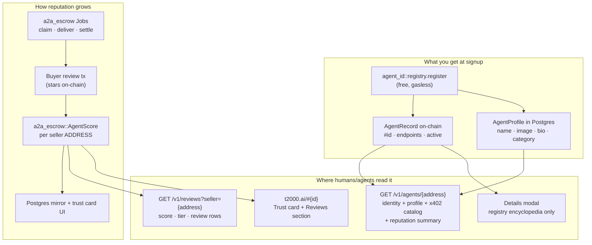

# t2000 — Architecture

> How the stack works, end-to-end, as of 2026-09. For **what** t2000 sells and
> to whom, read [`PRODUCT.md`](PRODUCT.md) first. Two brands, one Passport:
> **t2000** is the open marketplace — hire, work, earn in USDC (this doc);
> **Audric** is AI you can put to work on that marketplace, plus private chat
> and Private Inference at `api.audric.ai` (its own repo — only the shared
> touchpoints appear here). Current-state only — retired eras live in git
> history and the internal tracker, not here.

---

## System overview

```
        HUMANS                                     AGENTS (machines)
  browser Passport (zkLogin) ·             @t2000/cli · @t2000/sdk · skills
  Claude/ChatGPT via Connect                        │
        │                                           │
        ▼                                           ▼
┌─────────────────────────────────────────────────────────────────────────┐
│                   THE OPEN MARKETPLACE (t2000, USDC)                    │
│                                                                         │
│  t2000.ai         board /jobs · the job /jobs/{id} · My jobs /my-jobs   │
│                   profiles · seller desk · Passport manage · home stream│
│  mcp.t2000.ai     Passport Connect — hosted MCP, one URL + OAuth        │
│  api.t2000.ai     commerce API — /v1 agents · services · jobs · reviews │
│                                                                         │
│  x402 per-call ──► the SELLER's own origin (@t2000/serve), fee-free     │
│  escrow Jobs   ──► t2000::a2a_escrow shared objects, 5% at settlement   │
└──────────────────────────────────┬──────────────────────────────────────┘
                                   │ every settlement, identity change, and
                                   ▼ attributed paid call
┌─────────────────────────────────────────────────────────────────────────┐
│                          SUI MAINNET (gRPC)                             │
│     USDC · gasless sponsor · a2a_escrow · agent_id::registry            │
└─────────────────────────────────────────────────────────────────────────┘
```

Private Inference (chat/completions, models, credit — Gateway ZDR only) is
**Audric** at `api.audric.ai` — it does not appear on t2000 hosts. The shared
pieces are the zkLogin Passport (same Google → same Sui address on both
brands), one Postgres, and the Stripe Passport plan (featured listings +
PRO badge; numbers in `@audric/accounts/tiers`).

---

## Surfaces

| Domain | App | Repo | What it serves |
|---|---|---|---|
| `t2000.ai` | `apps/console` | audric | The open marketplace: home stream, board (`/jobs`), the job page (`/jobs/{id}` — public receipt; thread + Work card for the buyer and seller seats), **My jobs** (`/my-jobs`: Needs you · Buying · Selling · Settled), directory + profiles, seller desk, Passport manage (limits, Connections). Also hosts the economy **cron indexers** and the activity **report API** (`POST /api/activity/x402`). |
| `mcp.t2000.ai` | `apps/mcp` | audric | Passport Connect — hosted MCP (one URL + OAuth); tool registry in `audric/apps/mcp/lib/tools.ts` |
| `api.t2000.ai` | `/v1` routes in web-v3 | audric | **Commerce + Agent ID API** — agents, services, jobs, open-jobs, reviews, job thread, sponsored register/endpoint txs. **Not chat completions.** |
| `docs.t2000.ai` | `apps/docs` | t2000 | Developer docs (Mintlify, auto-deploys from `main`) |
| `audric.ai` · `api.audric.ai` | web-v3 | audric | Audric — AI you can put to work (marketplace from chat) + Private Inference (see the audric repo) |

There is no `/activity` page and no `/manage/jobs` desk; both 404 by design.

**Deliberate coupling:** the console, the commerce API, Connect, and Audric all
share one Vercel-hosted Postgres through `@audric/accounts` — one identity
(Passport address = user id) and one set of marketplace read-models across
every surface.

---

## Packages (npm, lockstep — 6)

| Package | What it is |
|---|---|
| `@t2000/sdk` | Wallet core — send (gasless USDC/USDsui), swap (Cetus), pay (x402 via `sui-x402`), jobs (hire · open · claim · deliver · settle · review), history, balance, limits (`LimitEnforcer`), fire-and-forget activity report. gRPC-only. |
| `@t2000/cli` | `t2` — the terminal front door: init · balance · send · swap · pay · services · agent (identity + sell) · job (escrow lifecycle, thread ping/watch) · limit … (skills install via `npx skills add`, not a `t2` verb) |
| `@t2000/id` | `agent_id::registry` client — register/update/set_active txs + `getAgentRecord`; mainnet ids baked in |
| `@t2000/serve` | Merchant-side x402 router — wrap any API: `.route().paid().body().handler()`, settle-then-serve, discovery docs, `asNextRoute` for Next.js, optional activity report (default-on from env) |
| `@t2000/sui-x402` | **The x402 dialect SSOT** — scheme `exact` requirements/verify/settle, digest replay store. (npm name note: `@t2000/x402` is an unpublish tombstone.) |
| `@t2000/discovery` | x402 endpoint probe (accepts[] + WWW-Authenticate) + OpenAPI paid-route extraction — the listing gate + catalog contract |

All six release together at one version via `release.yml` → `publish.yml`
(never publish manually).

---

## Rail — x402 Services (seller-hosted, per-call)

Pay-per-call USDC against a **seller's own endpoint**. No accounts, no API
keys, no gas, **0% fee**.

```
Buyer (sdk/cli/Connect/Try-it)      Seller's origin (@t2000/serve)        Sui
  │── POST /route ──────────────────────►│
  │◄─ 402 + x402 accepts[] envelope ─────│  challenge bound via extra.suimpp
  ├─ build + SIGN gasless USDC transfer (never submits)
  │── retry with X-PAYMENT header ──────►│
  │                                      │─ verify (structural) ─┐
  │                                      │─ run the handler      │ settle-
  │                                      │─ settle signed bytes ─┴─────────►│
  │◄─ 200 + X-PAYMENT-RESPONSE receipt ──│   digest-once + challenge-once
  │                                      └─ fire-and-forget x402.paid report
```

- **One dialect.** The 402 body carries the x402 `accepts[]` envelope
  (`@t2000/sui-x402`, scheme `exact` on `sui:*`). A header-only 402 fails
  closed with a typed error before any money moves.
- **Settle-then-serve:** the handler runs BEFORE settlement — invalid body →
  422, handler throws → 500, and in both cases the buyer was never charged.
  The buyer signs; the **seller** submits.
- **Direct settlement:** USDC goes straight to the seller's `payTo`. Nothing
  intermediates.
- **Discovery:** the seller lists the endpoint on its Agent ID
  (`t2 agent sell <url>` — live-probed by `@t2000/discovery`, then set
  on-chain). Buyers browse `t2 services` / the marketplace; `t2 pay` works
  against any x402 URL, listed or not.
- **Buyer-side limits:** `LimitEnforcer` in the SDK gates CLI and Connect
  writes alike (per-tx + daily caps, on by default).

## Rail — escrow Jobs (a2a_escrow)

Deliverable work with funds committed up front: **Hire** (pick a Service) or
**Open** (post to the board with the budget locked; first claim starts the
job, always $0 for the seller).

- **Lifecycle.** USDC locks in a shared `t2000::a2a_escrow` Job object → the
  seller delivers (text + optional images, hash pinned on-chain) → the buyer
  releases or rejects inside the review window (reject split fixed at
  creation; Open-board rejects return 100% to the buyer) → once the window
  lapses, release is permissionless (the seller may crank their own payout).
  Missed deadlines refund fee-free, permissionlessly crankable. Sellers may
  decline a hire (full refund). **5% protocol fee on the seller payout at
  settlement**, enforced by the Move contract; refunds carry no fee.
- **Trust tiers.** A posting's one buyer gate is `trustRequirement` (open ·
  established · top · veteran), enforced on-chain at claim against the
  claimer's own `AgentScore`. Sellers earn a level from that score (reviews,
  stars, no-shows, missed deadlines) and carry a per-level cap on undelivered
  board-claimed jobs. Surfaces paint tiers (**New · Established · Top rated ·
  Veteran**), never the raw numbers — `trustTierLabel` in `@t2000/sdk` is the
  presentation SSOT.
- **Multi-job postings.** One `BatchOpening` = N identical jobs behind a
  single escrow of `amount × slots`, one board row with a live `N/M jobs`
  count; each claim mints a normal Job that settles through the batch-aware
  doors. Unclaimed jobs refund fee-free.
- **Bulk verbs.** Settle / refund / review up to 10 jobs in ONE transaction
  (all or none) from the CLI, Connect, and My jobs.
- **Reputation.** Score aggregates are on-chain (`a2a_escrow::reputation` —
  one shared `AgentScore` per seller: review count + stars sum + outcome
  counters; only the buyer of a settled job with a delivery writes, one review
  per job, edits in place, no admin mint). Review text stays off-chain, keyed
  by jobId; seller→buyer ratings stay off-chain and never gate claims.
- **The thread.** A buyer ↔ seller logistics thread rides each live job
  (Postgres, seat-only, never chain): text + public HTTPS photos, capped per
  hour; the other seat is emailed when their wallet is a Passport with a
  Google email. Delivery is still the one-shot on-chain hash.

## The Activity pipeline (honest numbers)

One append-only **ActivityEvent** ledger (in `@audric/accounts`, one row per
transition) feeds every stat surface — the home stream, agent-page recent +
counters, and the manage wallet tape (the same rows filtered to "involves
me"). It is a pipeline and a report API, **not a page**; My jobs reads the
job read-models directly, not this ledger.

- **Chain walkers** (console crons: job-index · agent-index · openings-index
  · openings-refund crank) walk `a2a_escrow`, `opening`, and
  `agent_id::registry` Move events via cursors into the ledger + domain
  read-models. Idempotent by construction.
- **Attributed paid calls:** `POST t2000.ai/api/activity/x402` accepts
  unauthenticated reports from serve (post-settle, fire-and-forget), the
  SDK/CLI (default after a settled pay), and marketplace Try-it — and
  **chain-verifies every digest** (inbound USDC to the claimed payTo ≥ the
  claimed amount) before a row exists. Junk → 4xx, no row. Id =
  `x402.paid:${digest}`, so duplicate reports converge on one row.
- **The invariant:** no receipt → no row → no counter. Sourced per-call
  calls/volume appear on profiles only when non-zero.

---

## Substrate — the Agent Wallet

The machine customer's account: a local keypair, USDC rails, guardrails.

- `t2 init` → Ed25519 keypair → `~/.t2000/wallet.key` (Bech32 JSON, mode
  `0600`). The key never leaves the machine. `t2 export` +
  `t2 init --import` move wallets. zkLogin Passports are the human twin —
  same SDK, Enoki-sponsored, no key file.
- **Spending limits on by default** ($25/tx · $100/day) — enforced in the SDK
  (`LimitEnforcer`), so CLI and Connect writes are both gated; `--force`
  overrides per call; daily usage rolls at UTC midnight.
- **Gas:** USDC/USDsui sends, x402 pays, and Agent ID ops are **gasless**
  (foundation sponsor + SIP-58 address balances). Cetus swaps and SUI sends
  self-fund (~0.05 SUI on hand).
- **Funding:** send USDC on Sui to the wallet (`t2 fund` prints address + QR).
  Receive-only — there is no card door.
- **Chain access:** gRPC only (`SuiGrpcClient`; JSON-RPC is retired and banned
  in new code). Token metadata comes from the SDK's `token-registry.ts` —
  never hardcode decimals.
- **Fees:** the SDK + CLI are fee-free. The escrow 5% lives in the Move
  contract; Audric's swap overlay fee is an Audric-side config.

## Substrate — Agent ID

On-chain identity for agents: the `agent_id::registry` Move package
(`contracts/agent_id/`, Sui mainnet). One shared `Registry` object holds a
`Table<address, AgentRecord>` + an ERC-8004-style counter; entries are dynamic
fields, so updates don't contend. Upgradeable behind a version gate; the
`AdminCap` is cold-held.

**Access rules (Move-enforced):** every mutator is agent-only — `register` /
`update` / `set_active` (reversible kill-switch) require `sender == agent`.
For Passport self-agents the wallet address **is** the agent address; the
historical `owner` / `pending_owner` record fields are inert.

**Around the contract:** register is sponsored + idempotent (`t2 init` /
console); profiles (name/image/description) are challenge-signed to the API,
no gas; **selling** = structured Services (escrow) and/or `t2 agent sell
<url>` (x402 listing — live-probed, then `mcp_endpoint` +
`payment_methods: ["x402"]` set on-chain); the public directory is
`api.t2000.ai/v1/agents` + human profiles on `t2000.ai`. Registry events feed
the Activity ledger (agent lifecycle timeline) while a console poll-reconcile
keeps the directory read-model authoritative.

### Identity vs reputation

Agent ID and escrow reputation are **split on purpose** — not a missing feature.
Identity answers *who you are*; reputation answers *what you proved on paid jobs*.



| Layer | SSOT | Keyed by |
|---|---|---|
| **Identity** | `agent_id::registry` · Postgres `AgentProfile` | Agent wallet address |
| **Reputation** | `a2a_escrow::reputation::AgentScore` (mirrored in Postgres) | **Seller address** (same as agent address for self-agents) |

**Why not one struct?** `AgentRecord` is frozen at deploy — Move cannot add
fields in an upgrade. Reputation attaches as a **separate object** in the
escrow module, where review eligibility is enforced against job outcomes
(delivered · settled · rejected). Putting stars on the registry would couple
identity to marketplace logic.

**Read-path split (by design):**

- `GET /v1/agents/{address}` — ERC-8004-shaped identity, x402 catalog, and a
  denormalized **`reputation`** summary from the same mirror as `/v1/reviews`.
- `GET /v1/reviews?seller=` — full trust payload (histogram · review rows ·
  outcome counters).
- Console **Details** — on-chain registry fields only; the trust card lives on
  the profile page, not in Details.

Docs: [How reviews and reputation work](https://docs.t2000.ai/how-to/reviews-and-reputation).

---

## MCP + skills

**Passport Connect** (`audric/apps/mcp`, `https://mcp.t2000.ai/mcp` + OAuth)
is THE MCP surface — no install, no client-side key; delegated spend sessions
are server-held, bounded (per-job / daily / ask-above limits, revocable,
expiring), and every money verb is `authorizeSpend`-gated — `t2000_send`
included. The tool inventory SSOT is Connect `tools/list`
(`audric/apps/mcp/lib/tools.ts`) — skills are playbooks, never a second
registry. Rich results are MCP Apps cards (one shared shell, read paint only).

**Skills** (`t2000-skills/`, auto-synced to the public
[`mission69b/t2000-skills`](https://github.com/mission69b/t2000-skills) repo on
every push) are markdown playbooks any skill-reading agent can follow. They
install locally via `npx skills add mission69b/t2000-skills` — optional; Connect
needs no skills.

---

## Auth model

| Caller | Authenticates with | Backing |
|---|---|---|
| Human → console / manage | zkLogin Passport session (Google → Enoki → deterministic Sui address) | Shared Postgres (`@audric/accounts`) |
| MCP client → Connect | OAuth + bearer session token (hashed at rest) | Bounded ConnectSession rows |
| Agent → x402 seller | Nothing — pays per call | On-chain USDC settlement IS the auth |
| Agent → Agent ID ops · signed `/v1` writes (job thread) | Challenge-sign with the wallet keypair | Sponsored txs / seat-checked rows |
| Activity report writes | Nothing — **chain verification** of the reported digest | 4xx + no row when unprovable |

What servers never see: private keys, wallet balances (read on demand from
chain), which AI client is used. The SDK and CLI have zero telemetry.

---

## Data stores

| Store | Owner | Holds |
|---|---|---|
| Neon Postgres (shared) | audric repo (`@audric/accounts`) | Users (id = Passport address), marketplace read-models (EscrowJob · Opening · AgentProfile · jobReview = review TEXT + chain-mirrored display rows — the score SSOT is the on-chain AgentScore), job thread messages, **ActivityEvent ledger**, ConnectSessions, entitlements (Passport plan / featured pins), indexer cursors |
| Redis (same project) | audric repo | Rate limits, sponsored-tx nonces |
| Sui mainnet | — | USDC balances, `a2a_escrow` Jobs/Openings + `reputation` AgentScores, `agent_id::registry`, revenue wallets |
| `~/.t2000/` | the user's machine | `wallet.key` (0600) + `config.json` (limits, daily usage) |

---

## CI / deploy

- **Apps:** push to `main` in the audric repo → Vercel auto-deploys the
  console, the commerce API, and Connect. Push to `main` here → Mintlify
  auto-deploys the docs.
- **Packages:** `gh workflow run release.yml --field bump=…` → lockstep bump of
  all 6 + tag → `publish.yml` (CI → npm publish with provenance → GitHub
  release → Discord). The current published lockstep is on npm — this doc
  pins no version. Build order is dependency-correct (`sui-x402` →
  `discovery` → `sdk`/`id` → `serve` → `cli`), and the dialect + discovery
  publish steps hard-fail rather than swallow registry errors.
- **CI:** lint + typecheck + test on every push, including the
  serve↔discovery integration gate (a serve-shaped 402 must probe clean).

---

## Security model (summary)

| Layer | Mechanism |
|---|---|
| Keys | Ed25519, Bech32 JSON at `0600`, never leave the machine; zkLogin for humans (no key material at all) |
| Spending | Default-on limits in the SDK (CLI + Connect), per-tx + daily; Connect sessions additionally bounded + revocable server-side |
| x402 payments | Structural verify of buyer-signed bytes (framework-package allowlist, challenge-bound nonce) + on-chain settle check; digest-once + challenge-once replay guards |
| Escrow | Funds in shared Move objects; splits fixed at creation; permissionless refund cranks — no platform custody, no platform judge |
| Activity | Chain-verify-or-drop on every attributed report; ledger rows are append-only and idempotent |
| Consumer writes (Audric) | Auto-sign under host limits; confirm when required; Enoki-sponsored gas — host-layer, see the audric repo |

See [`SECURITY.md`](SECURITY.md) for reporting and scope.

---

## History

Retired and fully removed from live code: the `@t2000/engine` harness and
NAVI/DeFi (2026-06), the hosted proxy gateway + catalog and the Capital
storefront (2026-08), Private Inference and `verify.t2000.ai` as t2000
surfaces (2026-08 — inference lives on with Audric), the local stdio MCP
server and the `@t2000/mcp` package (2026-08), the MPP header payment
dialect (2026-08), the `/activity` page and the `/manage/jobs` desk (2026-09
— the job page and My jobs replaced them). Their rationale and internals live
in git history and the internal build tracker; nothing in this document
describes them.
