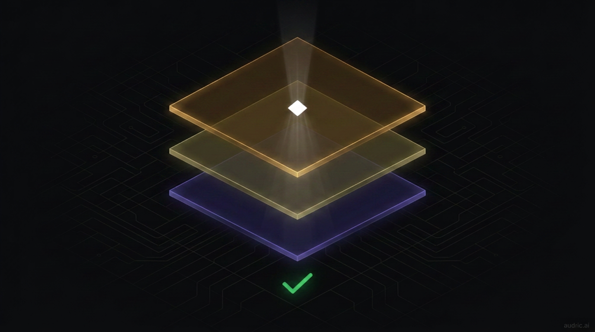

# What we removed, and why

> **Note for readers who saw the previous version of this article:** the original framing — a 4-stage "trust ladder" leading to fully autonomous execution — was retired on April 18, 2026. The full prior thesis is preserved in git history (`git log article-trust-layer.md`) for anyone who wants the record. What follows is the honest version. See [`spec/SIMPLIFICATION_RATIONALE.md`](./spec/SIMPLIFICATION_RATIONALE.md) for the long-form decision doc.

I spent a year building autonomy theatre.

Stages 0 through 3. Pattern detectors. Scheduled actions. Morning briefings. An on-chain "allowance" contract that bounded what the agent could spend without asking. A chain-memory pipeline that watched your wallet and proposed automations once it had enough evidence. All of it framed as a financial agent that earned trust over time and eventually acted on its own.

It looked clean in screenshots. The architecture diagram was beautiful.

It also wasn't honest. zkLogin — the thing that lets a user sign in with Google and get a non-custodial Sui wallet in three seconds — requires the user to be present in the browser for a signing ceremony. There is no headless variant. There is no offline ceremony. The "agent acting while you sleep" pitch only works if you give the application a custodial private key, or if you wait for the user to come back and tap a button. We were doing the latter and calling it autonomy.

So we ripped it out. The stages, the detectors, the scheduled flows, the briefings, the proactive nudges. ~12,000 lines of TypeScript and 10 Prisma tables, deleted in a week. We mailed users to tell them what we removed and why. We refunded the on-chain "features budget" balances back to their wallets.

What's left is the chat. That's the product.

---

## Product structure today

After the simplification, Audric is exactly four consumer products:

- **Audric Finance** — save, send, swap, borrow, repay, withdraw. Every write tap-to-confirm. NAVI for lending, Cetus aggregator for swaps, sponsored gas everywhere.
- **Audric Pay** — call any of 41 MPP-registered AI services with USDC micropayments. Cost shown first. Same chat surface as everything else.
- **Audric Intelligence** — the silent layer. Financial profile, conversation memory, chain memory, AdviceLog, the 9-guard runner, the reasoning engine. Never surfaces as a notification — only ever shapes the next reply.
- **Audric Store** — creator marketplace at `audric.ai/username`. Generate AI music, art, ebooks, list them, sell in USDC. Coming in Phase 5.

There is no fifth product. Anything not on that list is either an operation inside one of those four (lowercase verb), or it's the underlying t2000 infrastructure (engine, SDK, MCP, MPP gateway, contracts).

---

## What we kept

The framing changed. A surprising amount of the architecture didn't.

**The 9-guard runner still runs on every write.** Safety tier first (account locked, daily limit, health factor below threshold). Financial tier second (does the user have this balance, would this push leverage past threshold, is slippage acceptable). UX tier third (irreversible without confirmation, already failed this session, pending confirmation). Tier ordering is absolute — "the user confirmed" does not unlock a Safety block. The difference is that now the guards run before a confirmation card the user actively taps, not before a scheduled cron firing while they sleep. Same code. Different framing.

**The reasoning engine still routes by consequence, not complexity.** Balance lookups go to Haiku. Multi-step financial decisions go to Sonnet or Opus. Irreversible operations get extended thinking. Wrong routing costs more than 50ms of latency — it costs correctness.

**The 7 skill recipes still load by longest-trigger-match-wins.** swap-and-save, safe-borrow, emergency-withdraw, and four others. The agent doesn't improvise multi-step procedures. It follows tested ones with health-factor checks between steps.

**Chain memory still runs.** 7 classifiers extract structured facts from your on-chain history — recurring sends, idle balances, position changes. The change: those facts now feed silently into the LLM's context as background, not into a pattern detector that triggers a scheduled action proposal. Behavior still beats stated preference. The agent just uses that signal to answer better, not to ship reminders dressed up as proposals.

**zkLogin onboarding still takes three seconds.** Sign in with Google, derive a non-custodial wallet from your JWT, never see an address or a gas fee. Mysten's Enoki sponsors the gas. We never hold your keys.

**Sui's transaction layer still does the work.** Sub-second finality, native USDC, sponsored gas, ~$0 fees on intra-Sui transfers. "Send $50 to alice" still resolves in roughly 0.4 seconds.

What changed is the story we tell about all of that. None of it is autonomy. All of it is a chat that's fast, safe, and aware of who you are.

---

## What we removed

The deletion list, in order of how much of the codebase it touched:

- **Scheduled actions / DCA.** No cron writes to user wallets anymore. The 4 surviving cron jobs are read-only (memory extraction, profile inference, chain memory, portfolio snapshot).
- **Pattern-detected automations.** Behavioural pattern detectors deleted. Chain *facts* are kept; chain *triggers* are gone.
- **Morning briefings + rate alerts + copilot suggestions.** Zero proactive notifications. The only email Audric ever sends now is a critical health-factor warning if you're borrowing and HF drops below 1.2.
- **The 4-stage trust ladder.** Replaced with: every write requires a tap. Period.
- **The on-chain `allowance` contract in the active flow.** The Move type still exists on Sui mainnet (existing balances are owner-recoverable), but no shipping flow creates new allowances or charges them. Pre-simplification balances were refunded to users' wallets and logged in an `AllowanceRefund` table for audit.
- **The "features budget" on-chain enforcement layer.** With no autonomous execution, there's nothing to bound. You spend USDC directly, with a tap.
- **~12,000 LOC of TypeScript.** Pattern detectors, scheduled-action infra, copilot routes, allowance refill UI, briefing renderers, ~10 Prisma tables (down from 25 to 15).

Two things to call out specifically:

**The `allowance.move` Move type is dormant, not removed.** Removing it on-chain would orphan existing Allowance objects with non-zero balances. Instead the contract is left in place with the active flow disabled, the balances refunded, and the type marked dormant in our docs. Existing owners can `withdraw()` directly. New flows don't touch it.

**The intelligence layer is silent, not gone.** Financial profile, conversation memory, chain facts, AdviceLog — all still build, all still feed the LLM's context. They just never surface as nudges. The product makes them visible only when you ask. "What have I been spending on?" gets a real answer. We just stopped pushing.

---

## Why we did it this way

zkLogin is the constraint. We could have kept the autonomy theatre by switching to a custodial model — hold a private key per user on a server, sign with it on a schedule. Other neobanks do this. It's a defensible product. It's also not what we wanted to ship.

The non-custodial onboarding is the moat. Sign in with Google → wallet in three seconds → user keys never leave the user. That's the thing that makes Audric not-a-neobank. Once we accepted we couldn't break that property to chase autonomy, the simplification was just a question of cleanup speed.

The honest version of "Audric is an AI that manages your money" is "Audric is a chat that knows your finances better than any other interface, and runs every action in under a second when you tap go." The deleted features were trying to replace the tap. They couldn't, architecturally. Removing them made the chat itself sharper.

---

## What's still distinctive

After the deletions, the differentiation is narrower and more defensible:

**The chat is the dashboard.** Above the fold: balance pinned to the top, a single greeting, the chat input, a chip bar. No proactive feed. No handled-for-you cards. No nudges to swipe past. The first thing you do is ask.

**Every write is one tap.** No PIN screens, no multi-step approval flows, no scheduled-action confirmation emails. The 9-guard runner clears the operation, a confirmation card renders, you tap, the SDK builds the transaction, Enoki sponsors the gas, Sui finalises in under a second. End to end measured in low single-digit seconds.

**The agent knows you.** Silent profile, conversation history, chain facts, AdviceLog — assembled as context before the model sees your message. The agent doesn't ask you what your risk tolerance is. It already inferred it from how you've been moving money.

**40 tools, one engine.** 29 reads (balance, savings, health, rates, history, swap quotes, web search, transaction explainer, portfolio analysis, protocol deep dive, DefiLlama yields/prices/TVL, payment-link management, invoice management, contact lookup), 11 writes (save, withdraw, send, swap, borrow, repay, claim rewards, pay an MPP service, stake/unstake VOLO, save a contact). All routed through the same guard runner, all logged, all replayable by the agent in the next session.

**MPP — pay-per-use APIs, no keys.** "Send a birthday postcard to my mum" still routes through OpenAI for copy ($0.02), DALL-E for the image ($0.04), Lob for printing ($0.99). $1.05, three services, no API keys, every line item visible. We charge from your USDC balance with a tap. The protocol is open at `mpp.t2000.ai` — 40+ services, 88 endpoints — and works with any agent runner, not just ours.

**Daily-free billing.** No subscriptions, no per-message fees. Five chat sessions per rolling 24 hours for unverified users, twenty for verified. Verifying is one email round-trip. That's the entire pricing page.

---

## What we learned

A few things that survived the deletion and are worth taking forward, whether you're building on Sui or anywhere else:

**1. The signing layer determines the autonomy ceiling.** If your auth requires user presence to sign — zkLogin, WebAuthn, hardware keys — you cannot ship "agent acts while you sleep" without compromising the auth's core property. This isn't fixable in product. We tried.

**2. Silent intelligence beats proactive nudges, for an agent users actually open.** The chain-fact pipeline we kept is more valuable as background context than as a trigger source. Users open the chat and get an answer that already accounts for everything the agent knows about their wallet. Users do not enjoy notifications about their wallet. We had data on both and we deleted the noise.

**3. On-chain enforcement is overkill for a non-autonomous product.** The original allowance contract was an answer to "what if the application layer is compromised and starts moving money." With no autonomous flow, the application layer doesn't move money — the user does, with a tap, after a confirmation card. The 9-guard runner protects against bad agent decisions; the user protects against compromised application code by reading the card. A second on-chain enforcement layer earns its complexity only if you have an autonomous flow worth defending.

**4. Tap-to-confirm is not a usability tax. It's the value prop.** Every tap is a moment where the user sees what's about to happen, in plain English, with the dollar amount and the destination. That moment is the trust layer. It doesn't need a four-stage ladder.

**5. The cleanup was free at this stage.** A dozen users, a week of dev time, a single CASCADE migration, two npm releases coordinated. The same simplification at 100K users would have cost a quarter. Doing it now was the cheapest decision in the project.

---

## What's next

Better onramp first — buying USDC with a card, on the Audric chat surface, in the same conversation where you ask the agent to do anything else. Then cross-chain USDC, so the same chat can move money across Sui, Solana, and EVM USDC without the user needing to know which chain anything's on. Then more MPP services as the catalog grows.

The chat keeps getting better. That's the roadmap.

---

I'm building this in public at [audric.ai](https://audric.ai) (consumer) and [t2000.ai](https://t2000.ai) (open-source infrastructure, MIT licensed). The engine, SDK, CLI, and MCP server are all on npm — `@t2000/engine`, `@t2000/sdk`, `@t2000/cli`, `@t2000/mcp`.

The code is honest about what it does. The marketing copy now matches.

---
---

# Twitter threads — QT the article with each

> Each tweet is standalone. Pair with the listed image. Space them out over days.

---

### Tweet 1 — Main hook (QT the article)
**Image:** `article-hero-trust-layer-5x2.png`

I spent a year building autonomy theatre on a financial AI agent.

Trust ladder. Pattern detectors. Scheduled actions. Morning briefings. An on-chain allowance contract.

Last week I deleted ~12,000 lines of it because zkLogin can't sign while you sleep.

Wrote up what I learned.

---

### Tweet 2 — The constraint
**Image:** none

zkLogin — the thing that gives Google sign-in → non-custodial Sui wallet in 3 seconds — requires the user present in the browser to sign.

There's no headless variant. There's no offline ceremony.

"Agent acts while you sleep" only works if you go custodial. We weren't going to.

---

### Tweet 3 — The deletion list
**Image:** none

Removed:
- Scheduled actions / DCA
- Pattern-detected automations
- Morning briefings + rate alerts
- 4-stage trust ladder
- On-chain allowance contract (active flow)
- Features budget UI
- ~12,000 LOC + 10 Prisma tables (25 → 15)

Kept:
- The chat

---

### Tweet 4 — Guard runner survives
**Image:** `article-guard-runner.png`

The 9-guard runner still runs on every write — Safety > Financial > UX, tier ordering absolute.

Difference is now they run before a tap, not before a cron.

Same code. Different framing. Tap-to-confirm IS the trust layer. It doesn't need a 4-stage ladder.

---

### Tweet 5 — Silent intelligence
**Image:** `article-intelligence-layer-v2.png`

Financial profile, conversation memory, chain facts, AdviceLog — all still build. All still feed the LLM's context.

They just never surface as nudges. The product makes them visible only when you ask.

Silent intelligence beats proactive nudges for an agent users actually open.

---

### Tweet 6 — Chain memory reframed
**Image:** `article-chain-memory.png`

7 on-chain classifiers still run against your transaction history. Deposit patterns. Risk profile. Idle balances.

Kept as silent context. Deleted as automation triggers.

Behaviour still beats stated preference. We just stopped using it to ship reminders dressed up as proposals.

---

### Tweet 7 — MPP / postcard (still real)
**Image:** `article-mpp-protocol-v2.png`

"Send a birthday postcard to my mum"

→ OpenAI wrote the message · $0.02
→ DALL-E 3 designed the card · $0.04
→ Lob printed and mailed it · $0.99

$1.05. Three services. Zero API keys. Charged from your USDC with a tap.

Pay-per-use APIs are the model.

---

### Tweet 8 — One tap, sub-second
**Image:** none

The whole stack now: 9 guards clear → confirmation card renders → user taps → SDK builds tx → Enoki sponsors gas → Sui finalises.

End-to-end: low single-digit seconds.

The tap is the moment the user sees what's about to happen, in plain English. That moment is the trust layer.

---

### Tweet 9 — The honest billing model
**Image:** none

Daily-free billing. No subscriptions. No per-message fees.

5 chat sessions / rolling 24h unverified.
20 / rolling 24h verified.

Verifying is one email round-trip.

That's the entire pricing page. Pricing pages should be one paragraph.

---

### Tweet 10 — What we learned
**Image:** none

The thing I'd take to the next project:

Your signing layer determines your autonomy ceiling.

If auth requires user presence — zkLogin, WebAuthn, hardware keys — you cannot ship "agent acts while you sleep" without breaking auth's core property.

Not fixable in product. We tried.

---

### Tweet 11 — The cleanup was free
**Image:** none

A dozen users. A week of dev time. A single CASCADE migration. Two coordinated npm releases. One honest email.

Same cleanup at 100K users would have cost a quarter.

Simplification cost goes up the longer you wait. Do it now.

---

### Tweet 12 — Closing / roadmap
**Image:** `article-hero-trust-layer-5x2.png`

What's next:
1. Card → USDC onramp inside the chat
2. Cross-chain USDC
3. More MPP services

The chat keeps getting better. That's the roadmap.

Code is honest about what it does. Marketing now matches. [audric.ai](https://audric.ai)
