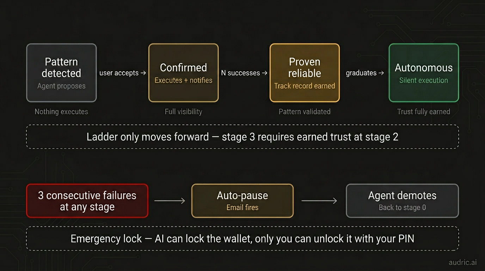
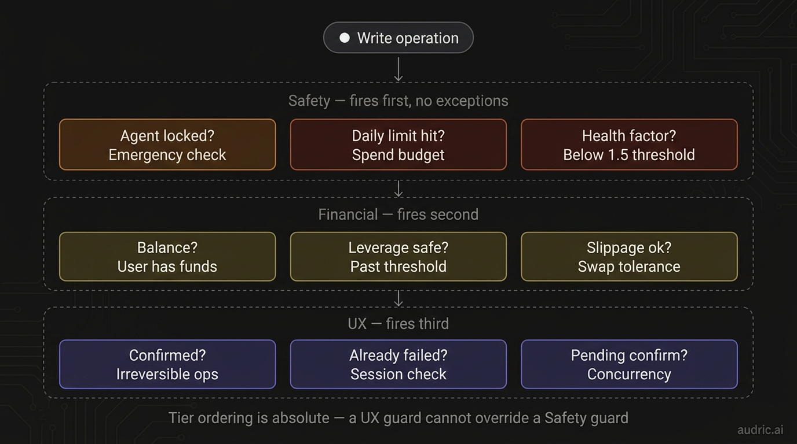
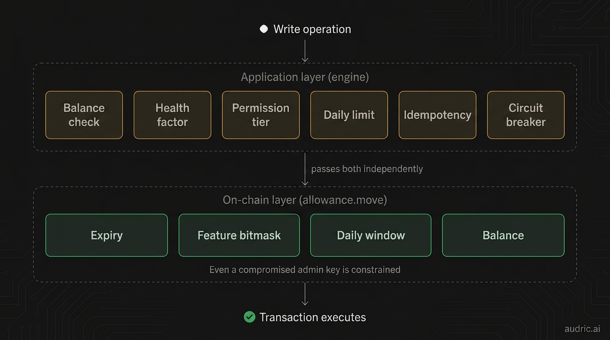
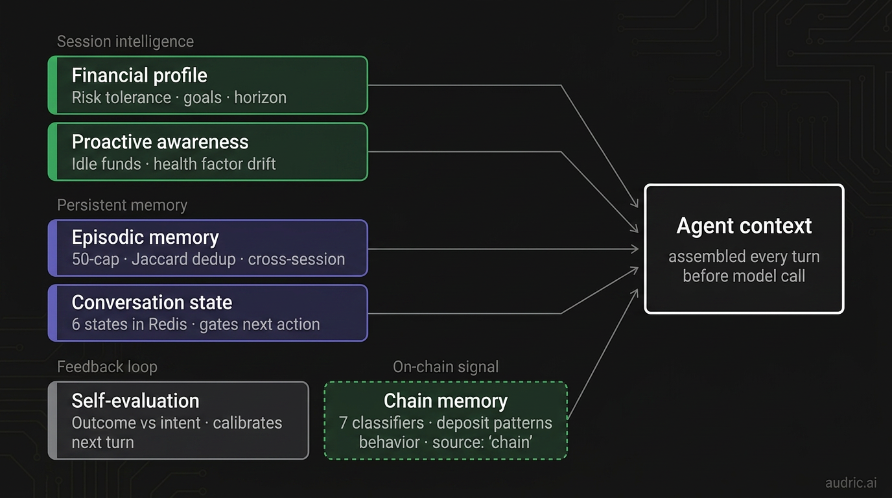
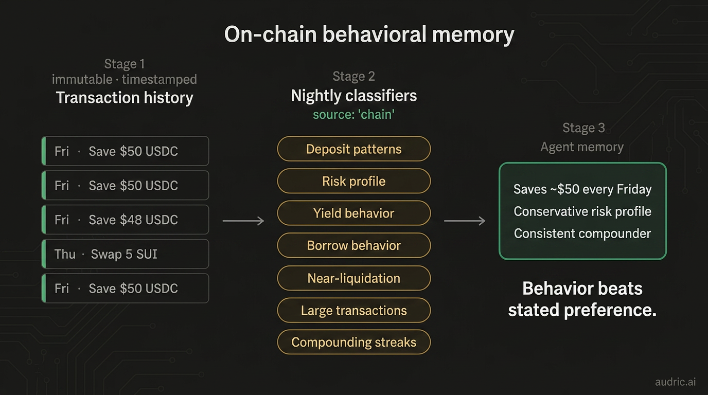
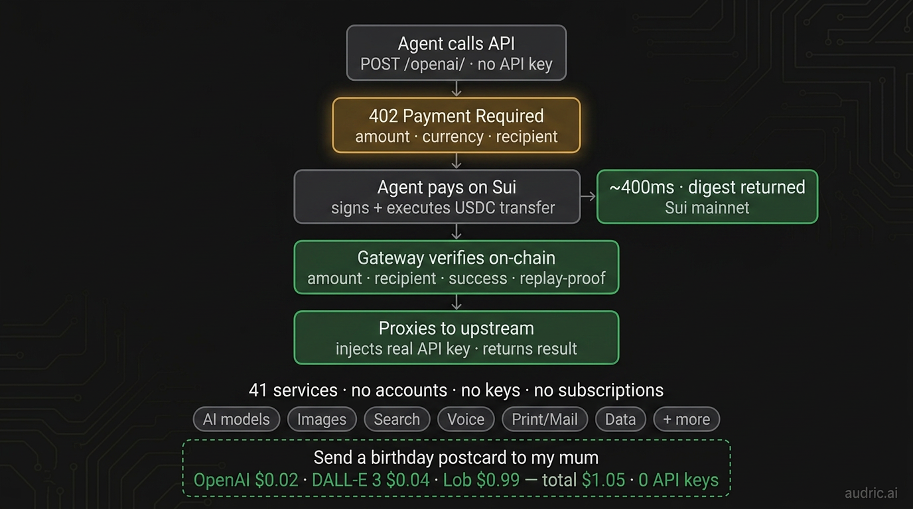
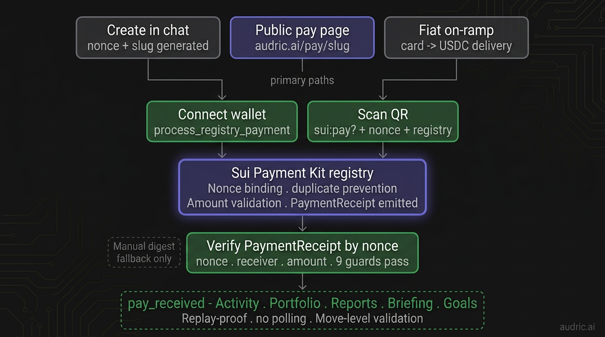
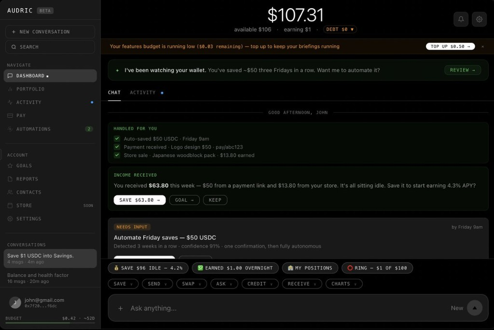
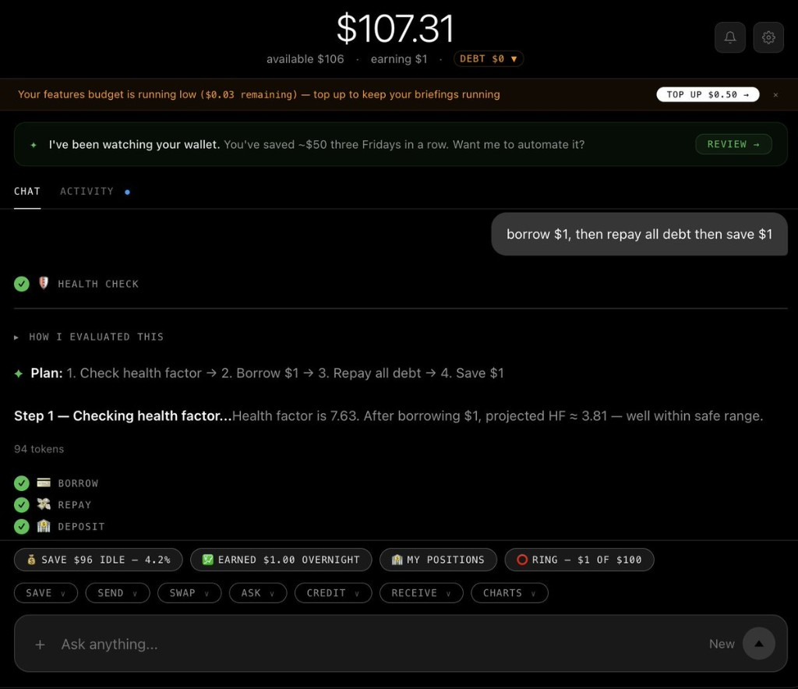

# The trust layer your AI agent is missing

> **⚠️ HISTORICAL DOCUMENT — PRE-SIMPLIFICATION**
>
> Long-form article describing Audric's 4-stage trust ladder, on-chain allowance contract, and pattern-detected autonomous actions, all of which were retired in the April 18, 2026 simplification. The current Audric is chat-first with no autonomous execution: zkLogin requires user presence to sign, so "trust ladder" autonomy was reminders dressed up as agency. The Allowance Move type still exists on-chain (owner-recoverable balances) but no shipping flow creates or charges it. See [`spec/SIMPLIFICATION_RATIONALE.md`](./spec/SIMPLIFICATION_RATIONALE.md) and [`AUDRIC_FINANCE_SIMPLIFICATION_SPEC_v1.4.md`](./AUDRIC_FINANCE_SIMPLIFICATION_SPEC_v1.4.md).
>
> Treat as an artifact of the prior thesis, not a current product description.

Giving an AI agent real autonomy is an unsolved problem.

Not because the models aren't capable. They are. In 2026, the model can do almost anything you give it tools for.

The gap is the layer between capability and trust.

Most builders never build it. They ship agents that ask for permission constantly — because they have no architecture for earning autonomy. Or they skip straight to autonomous execution — because building trust infrastructure is hard and nobody writes about it.

I built a financial AI agent that moves real money, earns yield, and executes autonomously while you sleep. I had to build the trust layer from scratch. Nothing I found online covered it.

Here's everything I learned.

---

## The permission problem is not binary

Most teams answer the autonomy question with a toggle. Allow. Deny.

That's not a trust system. That's a checkbox.

The right model is a ladder. Trust is earned operationally — through repeated successful execution — not granted upfront by a settings screen.

Here's how mine works:

### The Trust Ladder

*audric.ai — trust ladder architecture*

**Stage 0: Pattern detected.** Agent proposes. You review. Nothing executes.

**Stage 1: You accept.** Agent executes. You're notified every time. Full visibility.

**Stage 2: Confirmed N times.** The agent has proven it can handle this pattern reliably.

**Stage 3: Fully autonomous.** Silent execution. Trust fully earned.

The ladder only moves forward. Stage 3 has to be earned at Stage 2. You can't skip rungs.

And the circuit breaker: 3 consecutive failures at any stage auto-pauses the pattern, fires an email, and the agent demotes itself back to Stage 0. It doesn't keep running when things go wrong and hope you don't notice.

I've watched agents fail in production. The ones that break trust don't fail loudly — they keep going quietly. This system makes the agent accountable to its own record.

The first version of Audric had no circuit breaker. An automation ran while I slept. I woke up to a wallet that had executed the same pattern 11 times because nothing told it to stop. The pattern was technically correct. The context had changed. I had no mechanism to catch it. I rebuilt the entire execution layer the next day. The circuit breaker, the demotion logic, the email — all of it came from that morning.

---

## The Guard Runner

*9 guards. 3 tiers. All blocking.*

The trust ladder only works if the agent is trustworthy before it runs. That's a different problem entirely.

Every write operation passes through 9 guards before the tool call reaches the SDK.

**Safety tier fires first — no exceptions:**
- Is the agent locked?
- Has the daily spend limit been hit?
- Is the health factor below the safe threshold?

**Financial tier fires second:**
- Does the user actually have this balance?
- Would this push leverage past threshold?
- Is slippage on this swap acceptable?

**UX tier fires third:**
- Is this irreversible without explicit confirmation?
- Has this exact action already failed this session?
- Is there a pending confirmation already waiting?

The tier ordering is absolute. "The user confirmed" does not unlock a Safety guard block.

This isn't safety theater. It runs on every single write. Including the ones that look simple.

"Save $1 USDC" looks trivial. But before that executes: does the user have $1? Is the lending protocol healthy right now? Does this shift the health factor? Is there a pending borrow that changes the math?

There is no such thing as a trivial write when the consequences are irreversible.

---

## Two independent layers

*The guards run in the application. But what if the application is compromised?*

The 9-guard runner is the application layer. But application code can have bugs. Admin keys can be compromised. So there's a second layer that enforces constraints independently, on-chain.

A Move smart contract (`allowance.move`, deployed on Sui mainnet) enforces four checks at the blockchain level:

1. **Expiry** — reject if the allowance period has expired
2. **Feature bitmask** — reject if the operation type isn't permitted (8 feature codes, user-controlled)
3. **Daily window** — rolling 24-hour limit, reject if cumulative spend exceeds the user's budget
4. **Balance** — reject if insufficient funds

These two layers are fully independent. If the engine approves a transaction but the contract rejects it — wrong feature, limit exceeded, expired — the transaction fails safely on-chain. Even a compromised admin key can only use features the user explicitly permitted, within their daily limit, before expiry. The user can revoke everything with a single `withdraw()` call.

The application layer makes good decisions. The on-chain layer makes them enforceable.

---

## The reasoning engine

I run Claude Opus 4.6 with extended thinking. Not on hard questions only — on every turn where the consequence warrants it.

An effort classifier routes each turn based on consequence, not complexity:

| Consequence | Model | Example |
|-------------|-------|---------|
| Low | Haiku | Balance checks, simple reads |
| Medium | Sonnet | Analysis, explanations |
| High | Opus 4.6 | Multi-step decisions |
| Max | Opus 4.6 + extended thinking | Irreversible operations |

The routing adds ~50ms. Wrong routing costs far more — a borrow decision routed to Haiku could miss a health factor risk that Opus would catch. When the consequences are financial, you don't optimize for speed. You optimize for correctness.

Then 7 skill recipes activate from context — swap-and-save, safe-borrow, emergency-withdraw, and others. These are pre-built multi-step procedures that load automatically via longest-trigger-match-wins. The right procedure activates without per-request prompt engineering. The agent doesn't improvise a borrow-then-save sequence from scratch — it follows a tested recipe that includes the health factor check between steps.

---

## Five systems that learn who you are

The trust layer isn't just guards on individual operations. It's a persistent model of the user that gets smarter every session — plus a sixth system that reads the chain directly.

*Five intelligence pillars, assembled before the model sees your message.*

**Financial profile.** Opus infers your risk tolerance, goals, and investment horizon from conversation. Stored. Updated by background cron. The agent knows you're conservative before you say anything.

**Proactive awareness.** Injected every turn. $106 idle at 0% while savings rate is 4.3%? Surfaced. Health factor drifting toward a threshold? Warning fires before you ask. The agent doesn't wait for the right prompt.

**Episodic memory.** 50-memory cap. Jaccard dedup prevents semantic duplicates. It remembers you always save on Fridays. After three Fridays, it proposes automating it.

**Conversation state machine.** 6 states in Redis: idle, exploring, confirming, executing, post_error, awaiting_confirmation. The agent knows what mode you're in. You don't get a save prompt while a confirmation is already pending.

**Self-evaluation.** Post-action checklist after every write. Did the outcome match intent? Calibrates the next turn without persisting noise.

---

## Chain memory — behavior beats stated preference

This is the piece that took me longest to get right.

*Behavior beats stated preference. Every time.*

7 on-chain classifiers run continuously against your transaction history. They extract: deposit patterns, risk profile, yield behavior, borrow behavior, near-liquidation events, large transactions, compounding streaks.

Not inferences from conversation. Facts from the chain. Immutable. Timestamped.

You saved $50 every Friday for 6 weeks. That signal exists independently of anything you've ever typed. It lands in memory with `source: 'chain'`.

When the agent evaluates whether to propose an automation, it has what you said *and* what you did.

Behavior beats stated preference. Every time.

---

## Money as the permission layer

One more piece most builders skip: how does the agent pay for the tools it uses?

Standard answer: give it your API keys. One per service. Unlimited access. Subscriptions whether the agent runs or not.

Wrong model.

My agent gets a USDC budget. It pays per use via Machine Payments Protocol — from $0.001 per call — across 41 AI services. No keys. No subscriptions. Budget depletes as it acts. Run out and it stops. No overruns.

"Send a birthday postcard to my mum"
→ Wrote a personal message — OpenAI · $0.02
→ Designed the card — DALL-E 3 · $0.04
→ Printed and mailed it — Lob · $0.99

$1.05. 3 services. Every line item visible. No API keys anywhere.

Money is the permission layer — scoped, visible, and exhaustible by design.

*mpp.t2000.ai — 41 services proxied. No accounts, no keys, no subscriptions.*

---

## Sign in with Google. Get a wallet.

The hardest thing I had to solve wasn't the agent. It was onboarding.

Every other product that touches real money requires: account creation, KYC, seed phrase, browser extension, gas tokens. You lose people at every step.

Audric's onboarding: sign in with Google.

A Sui wallet is derived from your Google JWT via zkLogin. Same Google account, same wallet address, deterministically, every time. Non-custodial. No seed phrase. We never hold your keys.

Three seconds. Then the agent starts working.

---

## What the trust layer unlocks

"Send $50 to alice" — 0.4 seconds. $0 fee. Anywhere in the world.

No SWIFT code. No 3-5 business days. No correspondent bank.

That works because of Sui's transaction finality and USDC as the settlement layer. But it only works *safely* because the guard runner has already cleared balance, daily limit, and recipient validation before the transfer executes. And the on-chain allowance contract has independently verified the operation is within the user's permitted scope.

The speed is Sui's. The safety is the trust layer's. You need both.

Receiving money is the same story in reverse. "Create a payment link for $50" — the agent generates a shareable page at `audric.ai/pay/slug`. The payer connects a wallet or scans a QR code. A Move smart contract on Sui — the Payment Kit registry — binds the nonce, blocks duplicate payments, validates the amount on-chain, and emits a `PaymentReceipt`.

The trust layer verifies it: nonce, receiver, amount, 9 guards pass. Then the income flows into your portfolio, your morning briefing, and your weekly report automatically. No polling. No webhooks. On-chain events, verified at the Move level.

*Replay-proof · no polling · Move-level validation*

---

## What it looks like when the whole system runs

You open the app. Before you type anything:

✓ Auto-saved $50 USDC · Friday 9am
✓ Payment received · Logo design $50
✓ Store sale · $13.80 earned

Then:

*"I've been watching your wallet. You've saved ~$50 three Fridays in a row. Want me to automate it?"*

The model didn't guess that. It read the chain. Classified the pattern. Crossed the trust ladder threshold. Ran through 9 guards. Verified against the on-chain allowance. Surfaced the proposal at exactly the right moment.

That sentence took a year to build.

*audric.ai — proactive proposals, handled actions, trust-earned automations.*

"Borrow $1, then repay all debt, then save $1."

Three operations. Each one passes through 9 application guards independently. Each one is verified against the on-chain allowance contract. The health factor is checked before the borrow *and* rechecked before the save — because the borrow changed the math.

*Borrow, repay, save — three operations, one sentence, nine guards each.*

---

## Build this before you ship autonomy

The model is not the hard part. This is.

If you're building an agent with real stakes — financial, medical, legal, infrastructure — here are the three things to implement before you give it autonomy:

**1. A trust ladder, not a toggle.** Don't grant autonomy upfront. Make the agent earn it through confirmed executions. Stage 0 proposes. Stage 1 executes with notification. Stage 2 confirms reliability. Stage 3 runs silently. The ladder only moves forward. Add a circuit breaker that demotes the agent on consecutive failures.

**2. Tiered preflight guards — with on-chain enforcement.** Every write operation needs blocking validation before the tool call fires. Safety checks run first — no exceptions, no overrides. Financial checks run second. UX checks run third. The tier ordering is absolute. "The user confirmed" does not unlock a safety block. And if you can, enforce the constraints at a layer the application can't override — a smart contract, a hardware enclave, a separate service with its own keys.

**3. Memory that reads behavior, not just conversation.** Stated preferences lie. Behavior doesn't. Build classifiers that extract patterns from your agent's event log — what the user actually did, not what they said they wanted. That signal is more reliable than anything in the conversation history.

None of this requires a new model. It requires architecture.

The agents that earn trust and the agents that break it will be built on the same foundation models. The difference is what's built around them.

---

I'm building this in public at [audric.ai](https://audric.ai) (consumer) and [t2000.ai](https://t2000.ai) (open-source infrastructure, MIT licensed). The engine, SDK, and CLI are all available today.

---
---

# Twitter threads — QT the article with each

> Each tweet is standalone. Pair with the listed image. Space them out over days.

---

### Tweet 1 — Main hook (QT the article)
**Image:** `article-hero-trust-layer-5x2.png`

Most AI agents either ask for permission on everything or skip straight to autonomous execution.

Both are wrong.

I built a financial agent that moves real money while you sleep. The hardest part wasn't the model — it was the trust layer between capability and autonomy.

Wrote up everything I learned.

---

### Tweet 2 — Trust ladder
**Image:** `article-trust-ladder.png`

Your AI agent doesn't need a permission toggle. It needs a trust ladder.

Stage 0: proposes. Nothing executes.
Stage 1: executes + notifies.
Stage 2: proven reliable.
Stage 3: fully autonomous.

You can't skip rungs. And 3 consecutive failures demote it back to zero.

---

### Tweet 3 — The 11x failure story
**Image:** none (or `article-trust-ladder.png`)

The first version of Audric had no circuit breaker.

An automation ran while I slept. I woke up to a wallet that had executed the same pattern 11 times. The pattern was technically correct. The context had changed.

I rebuilt the entire execution layer the next day.

---

### Tweet 4 — Guard runner
**Image:** `article-guard-runner.png`

Every write operation in Audric passes through 9 guards before it executes.

Safety fires first — no exceptions.
Financial fires second.
UX fires third.

Tier ordering is absolute. "The user confirmed" does not unlock a safety block.

There is no such thing as a trivial write when consequences are irreversible.

---

### Tweet 5 — On-chain enforcement
**Image:** `article-onchain-enforcement.png`

Application guards make good decisions. On-chain guards make them enforceable.

Two fully independent layers. If the engine approves but the smart contract rejects — wrong feature, limit exceeded, expired — the transaction fails safely.

Even a compromised admin key is constrained.

---

### Tweet 6 — Intelligence pillars
**Image:** `article-intelligence-layer-v2.png`

Before the model sees your message, the agent has already assembled:

— Your financial profile (inferred by Opus, updated by cron)
— Proactive awareness (idle funds, health factor drift)
— Episodic memory (50 memories, persists forever)
— Conversation state (6 states in Redis)
— Self-evaluation from the last turn

---

### Tweet 7 — Chain memory
**Image:** `article-chain-memory.png`

Stated preferences lie. Behavior doesn't.

7 on-chain classifiers run against your transaction history. Deposit patterns. Risk profile. Compounding streaks.

You saved $50 every Friday for 6 weeks. That signal exists independently of anything you've ever typed.

Behavior beats stated preference. Every time.

---

### Tweet 8 — MPP / postcard
**Image:** `article-mpp-protocol-v2.png`

"Send a birthday postcard to my mum"

→ OpenAI wrote the message · $0.02
→ DALL-E 3 designed the card · $0.04
→ Lob printed and mailed it · $0.99

$1.05. Three services. Zero API keys. Every line item visible.

Money is the permission layer — scoped, visible, and exhaustible by design.

---

### Tweet 9 — Payment flow
**Image:** `article-payment-flow.png`

"Create a payment link for $50"

The agent generates a shareable page. Payer connects a wallet or scans a QR. A Move smart contract binds the nonce, blocks duplicates, validates on-chain, emits a PaymentReceipt.

Replay-proof. No polling. Move-level validation.

---

### Tweet 10 — Dashboard / "that sentence"
**Image:** `image-5e9069ec-0469-497b-9491-35f338142b7c.png` (dashboard)

"I've been watching your wallet. You've saved ~$50 three Fridays in a row. Want me to automate it?"

The model didn't guess that. It read the chain. Classified the pattern. Ran through 9 guards. Verified against the on-chain allowance. Surfaced it at the right moment.

That sentence took a year to build.

---

### Tweet 11 — Multi-step execution
**Image:** `image-b89191f8-4824-4868-9fb5-b660e68c7cf3.png` (conversation)

"Borrow $1, then repay all debt, then save $1."

One sentence. Three operations. Each passes through 9 guards independently. Health factor checked before the borrow AND rechecked before the save — because the borrow changed the math.

---

### Tweet 12 — Closing / builder takeaway
**Image:** `article-hero-trust-layer-5x2.png`

If you're building an agent with real stakes — financial, medical, legal — implement these three things before you give it autonomy:

1. A trust ladder, not a toggle
2. Tiered preflight guards with on-chain enforcement
3. Memory that reads behavior, not just conversation

None of this requires a new model. It requires architecture.
