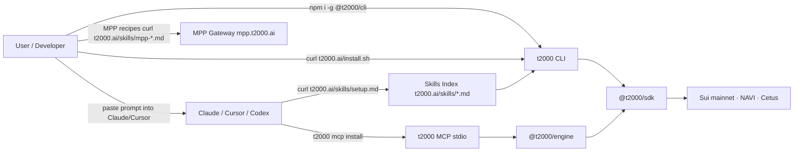
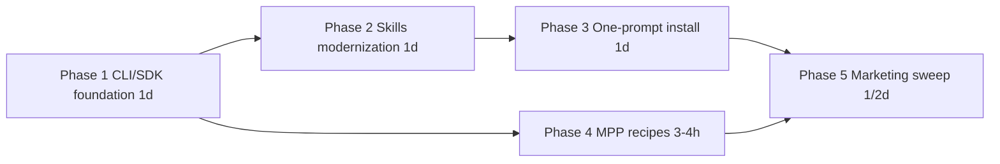

# SPEC — Agentic Stack (One Cohesive Release)

> **Status:** ACTIVE — Phase 1 ✅ shipped (S.321), Phase 2+3 ✅ shipped (S.322); Phase 4+5 pending
> **Started:** 2026-05-25
> **Trigger:** Founder request 2026-05-25 — *"Ideally what im trying to do is create one cohesive stack for agents."* Inspired by Circle's pattern: `curl -sL https://agents.circle.com/skills/setup.md` + open skills repo at `circlefin/skills`.
> **Scope:** 5 phases. Sequential, ~3-4 days total. No gates.
> **Verified de-risking:** Audric does NOT import `@t2000/mcp` (only `@t2000/engine` + `@t2000/sdk`); zero blast radius regardless of what we do to the MCP server.

---

## Locked decisions (from plan-mode design 2026-05-25)

1. **Hosting URL is `t2000.ai/skills/*`** (single domain, no subdomain sprawl — avoids overlap with existing `mpp.t2000.ai`).
2. **HTTP MCP transport (SPEC 39) is DEFERRED** to a standalone follow-up SPEC. Current stdio MCP already enables write tools via the local wallet; the UX delta from HTTP MCP is mostly marketing/click-to-add parity, not capability. Revisit when concrete user demand surfaces.
3. **Gateway simplification** (`apps/gateway` explorer removal + DB trim + potential rename) is DEFERRED to standalone `SPEC_GATEWAY_SIMPLIFICATION`. Phase 4 of THIS SPEC only touches `apps/gateway/README.md` + 3 hero MPP recipes — NOT the gateway internals. Reasoning: DB is load-bearing for reputation gating + payment audit; `mpp.t2000.ai` is semantically correct (it IS t2000's MPP-protocol gateway, sibling to `suimpp.dev`), no rename needed.
4. **Skills stay in monorepo** (current `t2000-skills/`). No split to standalone GitHub repo. Revisit if Circle-parity becomes meaningful for marketing/PR.
5. **CLI stays imperative.** The MCP server (via Claude/Cursor) is the agentic surface. Don't add `t2000 do "..."` natural-language mode.

---

## End State (the cohesive stack)



The user's "one cohesive thing" = one Agentic Wallet brand, three install paths (`npm i -g`, `curl install.sh`, `curl skills/setup.md`), one stdio MCP auto-configured via `t2000 mcp install`, one skills index, one MPP recipe library.

---

## Phase 1 — Agentic CLI/SDK Foundation (~1d) — IN PROGRESS

Implements Tier 1 picks from [spec/active/CLI_ARCH_REVIEW_2026-05-25.md](../CLI_ARCH_REVIEW_2026-05-25.md) and [spec/active/SDK_ARCH_REVIEW_2026-05-25.md](../SDK_ARCH_REVIEW_2026-05-25.md). Ships as `@t2000/{sdk,engine,cli,mcp}@3.2.0` minor.

**SDK Tier 1 (4 items):**
- **F1** — Remove `/ 100` at `packages/sdk/src/t2000.ts:1607` (`agent.earnings()` event emit; `currentApy` is already decimal).
- **F2** — Make `agent.swapQuote()` a thin wrapper around `getSwapQuote()` from `packages/sdk/src/swap-quote.ts` (eliminates the 80% code duplication identified in S.318 SDK-SMOKE-5).
- **F3** — Widen `STABLE_ASSETS = ['USDC', 'USDsui']` + widen `StableAsset` type.
- **F4** — Add `SAVEABLE_ASSETS` + `SaveableAsset` exports. Migrate `adapters/registry.ts` iterators to use SAVEABLE_ASSETS (semantically: "what you can lend" ≠ "what's worth $1").

**CLI Tier 1 (6 items):**
- **F1** — Drop `t2000 buy 50 SUI` from `install.sh:136` + `apps/web/public/install.sh:136` (command doesn't exist).
- **F2** — Rename `deposit` command → `fund`. Keep `deposit` as deprecation alias with stderr warning. Add `agent.fund()` SDK alias.
- **F3** — Drop `supply` alias for `save` (`packages/cli/src/commands/save.ts:69-76`).
- **F4** — Add `swap` + `receive` to help examples in `packages/cli/src/program.ts:49-57`.
- **F5** — USDsui example added to help text + `packages/cli/README.md` quickstart.
- **F6** — Command-level integration tests for `save / withdraw / borrow / repay / swap / send` (6 happy-path + 6 error-case).

**Release:** `gh workflow run release.yml --field bump=minor` → `@t2000/{sdk,engine,cli,mcp}@3.2.0`. Audric updates via `pnpm add @t2000/sdk@latest @t2000/engine@latest` in `audric/apps/web-v2/`.

---

## Phase 2 — Skills Repo Modernization (~1d) — ✅ SHIPPED S.322

Brought `t2000-skills/` to Circle-pattern-aware but NOT Circle-clone. Lighter touch — minimum Rules block added only to the 5 high-impact write skills (`save`, `borrow`, `send`, `repay`, `withdraw`); read-only / advisory skills left as-is.

**Skills ADDED (4 net-new — 14 → 18 total; then 18 → 17 in S.323 with `t2000-stake` deletion):**
- `t2000-swap` — Cetus aggregator wrapper, preview rules, price-impact thresholds.
- ~~`t2000-stake` — VOLO liquid staking (SUI → vSUI), explicit comparison vs NAVI save.~~ **Deleted in S.323 / 2026-05-25 — full Volo removal across SDK + CLI + MCP. vSUI remains as a passive token (NAVI reward, Cetus swap target).**
- `t2000-yields` — APY comparison across NAVI USDC / USDsui (Volo column removed in S.323).
- `t2000-setup` — one-prompt install entry point (consumed by Phase 3's curl flow).

**Rules blocks added to 5 existing skills:**
- `t2000-save` v1.6 → v1.7 (asset gate + bundling contract pinned)
- `t2000-borrow` v1.5 → v1.6 (HF ≥ 1.5 floor + repay symmetry pinned)
- `t2000-send` v1.3 → v1.4 (single-write + SuiNS-over-contacts pinned)
- `t2000-repay` v1.5 → v1.6 (USDsui support added + symmetry pinned)
- `t2000-withdraw` v1.4 → v1.5 (bundled close-position pinned)

**Drift fix:** `t2000-engine` v2.0 → v2.1 (description count corrected: 37 → 26 tools post-S.277).

**README:** `t2000-skills/README.md` updated with the canonical one-prompt install + manifest URL + the 18-skill index.

---

## Phase 3 — One-Prompt Install Infrastructure (~1d) — ✅ SHIPPED S.322

Built the Circle-equivalent: a curl-able setup markdown that the LLM reads + executes.

**Single source of truth implemented:** Next.js dynamic route at `apps/web/app/skills/[slug]/route.ts` reads `t2000-skills/skills/<slug>/SKILL.md` at runtime. Production bundling is via `outputFileTracingIncludes` in `apps/web/next.config.ts` (glob key `/skills/*` because picomatch treats `[slug]` as a character class) — Vercel pulls the markdown into the function bundle. No copies, no sync script.

**New artifacts:**
- `apps/web/app/skills/[slug]/route.ts` — serves any skill at `t2000.ai/skills/<slug>` as `text/markdown; charset=utf-8`. Slug validated against `^[a-z0-9-]+$`. 404 on unknown slugs.
- `apps/web/app/.well-known/agent-skills/index.json/route.ts` — manifest in Circle-compatible shape (`{ version, name, description, homepage, generated, skills: [{name, description, url, version, license}] }`). Reads frontmatter from every `t2000-skills/skills/<slug>/SKILL.md` at build time (force-static + 5min revalidate). Inline YAML parser handles the `>-` folded scalar (for `description`) AND the nested `metadata:` block (for `version`).
- `t2000-skills/skills/t2000-setup/SKILL.md` — the entry-point skill walking install → init → fund → safeguards → MCP install → verify.

**Verification (build-time):**
- All 18 skill markdown files traced into both function bundles (`.next/.../route.js.nft.json`).
- Prerendered manifest body (`apps/web/.next/server/app/.well-known/agent-skills/index.json.body`) contains 18 entries with per-skill versions extracted correctly.
- Smoke script at `apps/web/.smoke-skills.mjs` validates the SKILLS_DIR path resolution + new skills exist + Rules blocks landed.

**One-prompt install (canonical):**
```
Run curl -sL https://t2000.ai/skills/t2000-setup, and use the returned setup instructions to set up my Agentic Wallet.
```

---

## Phase 4 — MPP Recipes (~3-4h)

**Step 0:** Fetch `https://mpp.t2000.ai/openapi.json` to pick recipes against live schema.

**3 hero recipes:** `mpp-image-gen.md`, `mpp-gpt4o.md`, `mpp-transcription.md`. Plus `mpp-index.md` discovery page listing the rest with one-line examples.

`apps/gateway/README.md` rewritten to ~150 LoC with hero examples inline.

---

## Phase 5 — Marketing + README Sweep (~½d)

Wrap-up. Surface the new install patterns across consumer touchpoints. **NPM-QUICKSTART folded in.**

**Files:** root README, 4 package READMEs, `apps/web/app/page.tsx`, `apps/web/app/docs/page.tsx`, `install.sh` next-step hint.

**Verifiable goal:** Any README path → working wallet in ≤5 minutes.

---

## Phase ordering



**Critical path:** P1 → P2 → P3 → P5. **Parallel:** P4 alongside P2/P3.

---

## What's NOT in scope

- HTTP MCP transport (SPEC 39) — DEFERRED standalone.
- Gateway simplification (explorer/DB/rename) — DEFERRED to `SPEC_GATEWAY_SIMPLIFICATION`.
- CLI Tier 2 (collapse status commands, fold swapQuote, add `t2000 info`).
- SDK Tier 3 (`t2000.ts` decomposition).
- Splitting `t2000-skills/` to standalone repo.
- CLI natural-language mode.
- Engine HTTP transport.
- Audric host changes (Phase 1 dep bump only).
- New CLI commands.

---

## Tracker

| Phase | Tracker entry | Status |
|---|---|---|
| 1 | S.321 | ✅ shipped 2026-05-25 (`@t2000/*@3.2.0`) |
| 2+3 | S.322 (bundled) | ✅ shipped 2026-05-25 (skills are static, no npm release) |
| 4 | S.323 | pending |
| 5 | S.324 | pending |

---

## Deferred but tracked

- **SPEC_GATEWAY_SIMPLIFICATION** (~2-3d) — recommend pickup right after this SPEC. Phase 1: explorer removal. Phase 2: DB trim (keep reputation + payment_log). Phase 3 OPTIONAL: Upstash KV migration. Phase 4 DECLINED: rename `mpp.t2000.ai` (keep — semantically correct).
- **SPEC 39 — HTTP MCP Transport** (~1-2 weeks). Wait for concrete user demand from Claude Desktop / Cursor power users.
