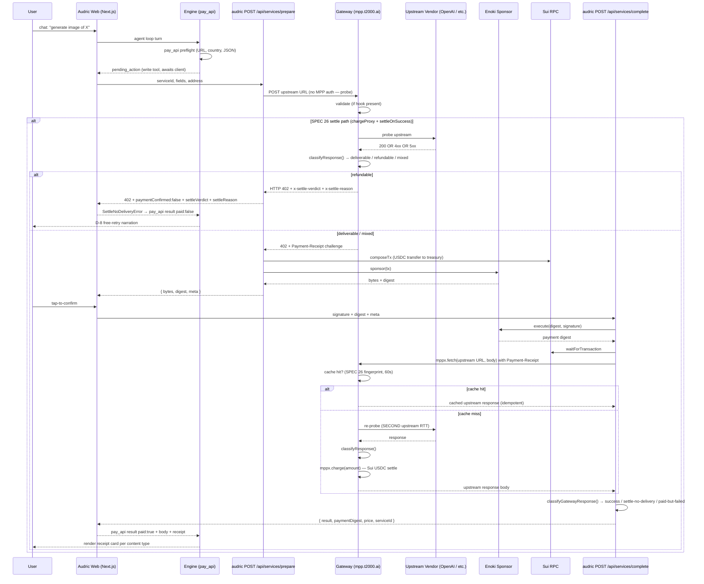

# SPEC 29 — MPP Cross-Repo Audit (v1)

> **Status:** v0.1 DRAFT — drafting complete 2026-05-14 ~08:30 AEST, awaiting founder final review + lock. Read-only architecture audit + design doc covering the full MPP surface across t2000 gateway + t2000 engine + audric web + future Audric Store. Does NOT implement findings (each phase becomes its own SPEC). SPEC# is a placeholder until founder lock at v0.1; "29" is next available given SPEC 27 + 28 are scope-locked but undrafted.
>
> **D-question lock summary (2026-05-14 ~08:25 AEST):** All 11 D-questions locked in one founder session.
> - **D-1** locked: (b) Automatic failover with health probes (~5d for image gen).
> - **D-2** locked: (b) audric server-side cron stop-gap NOW + (a) gateway-issued `refund(digest)` LATER post-Mysten coord.
> - **D-3** locked: (a) Extend `chargeCustom` with body-derived cost + settle-on-success (sequenced after D-2 stop-gap).
> - **D-4** locked: (a) Phase 5 hard cut — Walrus + Seal from day 1.
> - **D-5** locked: (b) Separate Audric Store Phase 5 master spec.
> - **D-6** locked: (c) Per-route circuit breaker.
> - **D-7** locked: (b) Wait for SKU demand with explicit triggers (Suno = compose_audio, video pilot = compose_video).
> - **D-8** locked: (a) Flat 92/8 per current roadmap.
> - **D-9** locked: deferred to Phase 0 telemetry pull (Section 4 drafts in follow-up session).
> - **D-10** locked: (a) Ship SSOT before Store launch as Phase 2 of this audit.
> - **D-11** locked: (a) Port `compose_pdf` + `compose_image_grid` to t2000 engine.
>
> **Phase plan summary (post-locks):** 10 phases, ~22-24d focused engineering effort (excl. Phase 0 founder time). Critical path to Audric Store launch readiness: Phase 1 → Phase 2 → Phase 4 → Phase 3 → Phase 5 → Phase 6 = ~16-18d. P0 closure: F-7 Day 1, F-13 Day 8-9, F-11 Day 12-13. F-20 stays open (owned by Audric Store master spec).
>
> **Founder framing 2026-05-14 ~07:50 AEST (post-SPEC-26 v1.0.4 smoke success):** *"Before we move into a full blown security deep dive spec lets close the loop with this and mpp in general. Also I feel like we almost need a full deep dive on mpp in it self its just a massive feature set across multiple repos and we need to map everything out on the product and technical side with audric and the store and see if there are any gaps, ux issues, or missing features like engine tools. i think the majority of mpp services for now will be used at the store, i dont want to build something fragile and unreliable. what would happen if 100 users call the try and generate images, ebooks etc, how wll that even scale as well need to unlock the store. Need to think through all the different kind of content people can create then sell, use of Recipies etc. also we promote using walrus and seal on the store but yet we use blob store lol"*
>
> **Trigger:** SPEC 26 closed the structural "user paid for nothing" failure mode on 65 of 86 charged routes. Audric Store launch (Phase 5) is the next major MPP volume driver — creators selling generated content (images, ebooks, audio, video) means MPP becomes the marketplace's spinal cord. Before scaling, audit the surface end-to-end: what's wired, what's drifting, what's missing, what won't scale.
>
> **Local-only, gitignored** — same convention as SPEC 23 series, SPEC 24, SPEC 25, SPEC 26, AUDRIC_HARNESS_*_SPEC, audric-roadmap, audric-build-tracker, HANDOFF_NEXT_AGENT.
>
> **Predecessors:**
> - SPEC 24 (MPP Integration Audit + Smoke Harness) — closed Phase 1+2; F5 folded into SPEC 28.
> - SPEC 25 (MPP Single Source of Truth) — DEFERRED; design intact at `spec/SPEC_25_MPP_SINGLE_SOURCE_OF_TRUTH.md`.
> - SPEC 26 (MPP Settle-on-Success) — SHIPPED v1.0 + v1.0.2 + v1.0.3 + v1.0.4 hotfix series.
> - `spec_native_content_tools` (compose_pdf + compose_image_grid) — SHIPPED in audric.
>
> **Successors (this audit produces inputs for):**
> - SPEC 27 EBOOK_WORKFLOW (cascading regen for the Audric Store ebook product flow).
> - SPEC 28 REGRESSION_HARNESS_v1 (slots after this audit since findings may reshape its phase plan).
> - Each Phase in §11 may become its own implementation SPEC at founder's discretion.
>
> **Out of scope (explicit):**
> - Implementation of any finding — that's downstream SPECs.
> - Drafting SPEC 27 or SPEC 28 (those are scope-locked separately).
> - Restarting SPEC 16 (atomic batching) — paused; this audit references but doesn't restart.
> - Walrus + Seal storage implementation — `spec_audric_store_storage_walrus_seal` placeholder owns it; this audit defines the trigger conditions.
> - Storefront UI / creator payout flow — Audric Store Phase 5 owns it; this audit scopes the dependency.
> - Security pivot — queued after this audit closes.

---

## Table of contents

**Part 1 — Current State Audit** (drafted)
- §1 Product map: 5 Audric products × MPP × Store-readiness
- §2 Technical chain map per content type (mermaid)
- §3 Gateway inventory — post-SPEC-26 state (86 charged routes)
- §4 Audric MPP integration — current state + drift sites
- §5 Existing SPEC + placeholder coverage matrix

**Part 2 — Findings** (drafted) — 22 findings across drift / architecture / Store-readiness; 4 P0s

**Part 3 — D-questions** (drafted, all 11 LOCKED 2026-05-14)

**Part 4 — Worked load model + scale** (PLACEHOLDER — Section 4 drafts in follow-up session post Phase 0 telemetry pull)

**Part 5 — Phases + acceptance gates** (drafted, G29-0..G29-9)

**Part 6 — Out of scope + cross-references**

---

## Part 1 — Current State Audit

### §1 Product map: 5 Audric products × MPP × Store-readiness

The canonical 5-product framing from `[CLAUDE.md](../CLAUDE.md)` L72-117: **Audric Passport, Intelligence, Finance, Pay, Store**. MPP is the engine layer all five eventually depend on (Store most heavily). Mapping which product owns which MPP-driven user verb today vs at Store launch:

| Audric product | User verb | MPP route(s) used | Today | Store launch (Phase 5) |
|---|---|---|---|---|
| 🪪 **Passport** | sign-in / wallet creation / tap-to-confirm / sponsored gas | none (zkLogin + Enoki, no MPP) | shipped | unchanged |
| 🧠 **Intelligence** | LLM reasoning / multi-step agent | none (Anthropic direct via engine, no MPP for LLM itself) | shipped | unchanged |
| 💰 **Finance** | save / borrow / swap / repay / charts | none (NAVI + Cetus direct via SDK, no MPP) | shipped | unchanged |
| 💸 **Pay** | send / receive / payment-link / invoice | none (direct USDC transfer, no MPP) | shipped | unchanged |
| 🛒 **Store** | generate AI content for sale / list / pay-to-unlock / creator payout | **`pay_api(openai/v1/images/generations)`** for cover art, **`pay_api(openai/v1/audio/speech)`** for sample narration, **`pay_api(openai/v1/chat/completions)`** for prose generation, **`compose_pdf`** + **`compose_image_grid`** for binding (native, no MPP), **`pay_api(elevenlabs/...)`** for premium voice, **future** Suno / Runway for music + video | Audric users generate via chat for personal preview; profile page renders "Coming soon — Audric Store" placeholder (`apps/web/app/[username]/page.tsx` L358-374) | **MPP becomes the spinal cord** — creator generates via chat → list → buyer pays → Walrus + Seal asset delivery → 92% USDC to creator |

**Implication.** MPP usage today is single-user (creator generates for themselves). At Store launch, MPP usage becomes **N creators × M buyers** with a fan-out per listing (every preview hit may re-generate or fetch from cache). The current MPP architecture was designed for the single-user case. Sections §2-§5 audit whether that architecture survives the multi-user case.

**Out of scope for this product map:** Creator pricing tiers / volume discounts / per-SKU economics. Roadmap sets 92/8 split; no SKU-tier model exists anywhere. See finding F-CreatorPricing in Part 2 + D-8 in Part 3.

---

### §2 Technical chain map per content type

The MPP request lifecycle is **identical for all charged content types** but the receipt + render surfaces diverge. One sequence diagram covers the chain; one inventory table covers the divergence.

#### §2.1 The shared MPP chain (post-SPEC-26)

**File citations:**
- Audric `services/prepare`: `apps/web/app/api/services/prepare/route.ts` (full lifecycle).
- Audric `services/complete`: `apps/web/app/api/services/complete/route.ts` + sibling `classify-gateway-response.ts`.
- Gateway `chargeProxy` + `chargeProxySettleOnSuccess`: `[apps/gateway/lib/gateway.ts](../apps/gateway/lib/gateway.ts)` lines 92-157 (legacy entry), 372-664 (settle-on-success path).
- Gateway upstream-response cache: `[apps/gateway/lib/upstream-response-cache.ts](../apps/gateway/lib/upstream-response-cache.ts)` + `[apps/gateway/lib/upstash-upstream-response-cache.ts](../apps/gateway/lib/upstash-upstream-response-cache.ts)`.
- Engine `pay_api`: `[packages/engine/src/tools/pay.ts](../packages/engine/src/tools/pay.ts)`.
- SDK `T2000Agent.pay()`: `[packages/sdk/src/t2000.ts](../packages/sdk/src/t2000.ts)` lines 208-267.

**Notes on the chain:**
- **Double-probe** — every successful pay flow probes the vendor twice (prepare-phase + complete-phase). The SPEC 26 60s upstream-response cache reduces this to 1 actual RTT in the steady state, BUT only when the prepare and complete happen within the cache window AND the body fingerprint matches exactly. Cold-cache flows pay the latency cost twice. Defer/efficiency tradeoff per SPEC 26 v1.0.1 reasoning.
- **Audric Enoki settles BEFORE gateway charge** in `services/complete` — Enoki executes the user-signed sponsored tx (Sui USDC moves to treasury) before the gateway is called with `Payment-Receipt`. If the gateway then fails to charge (e.g. cache failure-tolerance returns `undefined`, or vendor 5xx during complete-phase probe), USDC is orphaned in treasury. The `paymentDigest` is preserved in the response so a future support / refund flow can locate it. This is the "audric pre-settle gap" — out of scope for SPEC 26 v1, owned by the deferred `refund(digest)` MPP primitive (SPEC 26 O-4). Tracked as F-AudricOrphan in Part 2.
- **Native compose path (compose_pdf, compose_image_grid)** does NOT enter this chain — it's audric-side, no MPP charge, results in a Vercel Blob URL with 7-day soft TTL. Different chrome (DownloadableArtifact card) than MPP receipts.

#### §2.2 Per-content-type receipt + render divergence

Same MPP chain → different render surfaces depending on content type. The split is structural (some content types have rich previews, others are text receipts) but the visual chrome inconsistencies are not all justified.

| Content type | MPP route | Receipt component | On-chain digest? | Card chrome |
|---|---|---|---|---|
| Image generation | `pay_api(openai/v1/images/generations)` | `apps/web/components/engine/cards/mpp/CardPreview.tsx` + `ReviewCard` | Yes (Suiscan link) | MPP shell + sparkle header + AI-DESIGNED pill, vendor label "OPENAI · IMAGE" (post-v1.0.4) |
| OpenAI TTS | `pay_api(openai/v1/audio/speech)` | `TrackPlayer` + `ReviewCard` | Yes | MPP shell + dark gradient body. **Stale copy:** "PREVIEW · IN-CHAT" at TrackPlayer.tsx L263-266 contradicts the artifact-is-final framing |
| Whisper transcription | `pay_api(openai/v1/audio/transcriptions)` | `VendorReceipt` (vendor=OpenAI) | Yes | "OPENAI · MPP" header, no sparkle, textual body |
| GPT chat completions | `pay_api(openai/v1/chat/completions)` | `VendorReceipt` (vendor=OpenAI) | Yes | Text receipt, same pattern |
| ElevenLabs voice | `pay_api(elevenlabs/...)` | `TrackPlayer` + `ReviewCard` | Yes | Same audio MPP UI pattern |
| PDFShift (HTML→PDF gateway) | `pay_api(pdfshift/...)` | `BookCover` | Yes | Fixed header "PDFSHIFT · BOUND", "Open PDF →" link |
| Postcards / letters (Lob) | `pay_api(lob/v1/postcards or letters)` | `VendorReceipt` (vendor=Lob) | Yes | Physical-fulfillment text template with ETA |
| Email (Resend) | `pay_api(resend/...)` | `VendorReceipt` (vendor=Resend) | Yes | Text receipt |
| Failures | `pay_api` error envelope | `ErrorReceipt` | If charged: yes; refundable: no | "{VENDOR} · MPP · FAILED", paid-vs-unpaid copy |
| **Native PDF** (no MPP) | `compose_pdf` | `DownloadableArtifact` (kind=pdf) | **No** (no charge) | `CardShell` title "PDF", no MPP header, **no payment digest**, "Snapshot — re-run the prompt to refresh." chip |
| **Native image grid** (no MPP) | `compose_image_grid` | `DownloadableArtifact` (kind=image) | **No** (no charge) | Same DownloadableArtifact card family |

**Two visual families coexist:**
1. **MPP receipts** — sparkle/✦ chrome, Suiscan digest link, "{VENDOR} · MPP" header, $X.XX amount in the chip.
2. **DownloadableArtifact** — different card primitive, no on-chain digest (compose tools are free), "Snapshot — re-run the prompt to refresh." disclaimer (SPEC 27 stop-gap).

This split is **partially intentional** (no charge means no digest to show) but **partially drift** — when SPEC 27 ships cascading-regen for image → grid → PDF, the resulting bound artifact will be a multi-step composition where SOME steps charged (the image generation) and SOME didn't (the bind step). The receipt UX needs to either unify or explicitly explain the split. Deferred to SPEC 27. Tracked as F-ChromeDivergence in Part 2.

**Glyph gap** — `getPayApiGlyph` in `apps/web/components/engine/AgentStep.tsx` L151-160 covers `/openai/v1/images`, `/openai/v1/audio/transcriptions`, `/openai/v1/chat`, but **no branch for `/openai/v1/audio/speech`** (TTS). TTS step shows the fallback `⚡` glyph instead of a vendor-specific one. Tracked as F-Glyph in Part 2.

**Retry-route SPEC 26 parity gap** — `apps/web/app/api/services/retry/route.ts` does NOT import `classifyGatewayResponse` or `extractVendorErrorMessage`. If a retry hits a settle-no-delivery 402, the LLM gets a generic envelope instead of the typed verdict + reason → same bug class as v1.0.3 fixed for `services/prepare`. Tracked as F-Retry in Part 2.

---

### §3 Gateway inventory — post-SPEC-26 state

86 charged routes total across `apps/gateway/app/**/route.ts`. Inventory derived from `[apps/gateway/lib/services.ts](../apps/gateway/lib/services.ts)` (the public catalog) cross-referenced with actual route files. **All `chargeProxy` routes are on `settleOnSuccess: true` post-P8 bulk migration** (verified via shell grep — zero `chargeProxy` calls without the `settleOnSuccess` flag). The remaining gap is **`chargeCustom`** (21 routes — commerce, async, dynamic-pricing — out of scope for SPEC 26 v1).

#### §3.1 Counts by HOC

| HOC | Routes | Settle-on-success? | Custom classifier? | Validate hook? |
|---|---|---|---|---|
| `chargeProxy` (with `settleOnSuccess: true`) | 65 | yes (all) | only OpenAI images uses `classifyOpenAiImagesResponse`; rest use `DEFAULT_CLASSIFY_RESPONSE` | only OpenAI images (`validateImagesGenerationsBody`) + SerpAPI flights (`validateFlights`) |
| `chargeCustom` | 21 | **no** (option doesn't exist on `chargeCustom`) | n/a | n/a |
| Routes not in `services.ts` catalog | 1 known (`/e2b/v1/execute`) + lob/printful internal companions | n/a | n/a | n/a |

#### §3.2 chargeCustom routes (the SPEC 26 long-tail)

These 21 routes use `chargeCustom` because their cost depends on the request body (Lob postcard sizes, Printful order line items, Stability per-image rates, etc.) or they're commerce/async-fulfillment endpoints that can't be modeled as fixed-cost probes. None are on settle-on-success.

| Vendor | Route | Why chargeCustom |
|---|---|---|
| Judge0 | `/v1/submissions` | Per-execution cost varies; status polling separate |
| Lob | `/v1/postcards`, `/v1/letters`, `/v1/verify` | Per-piece pricing; async print fulfillment (3-day delivery) |
| Jina | `/v1/read` | Per-page / token-based pricing |
| QR Code | `/v1/generate` | Per-image (low cost, fixed) — could migrate to chargeProxy |
| Replicate | `/v1/predictions/status` | Status polling, low cost |
| Stability | `/v1/generate`, `/v1/edit` | Per-image variable pricing |
| AssemblyAI | `/v1/transcribe`, `/v1/result` | Async transcription + result polling |
| IPinfo | `/v1/lookup` | Per-lookup tier-based |
| Printful | `/v1/products`, `/v1/estimate`, `/v1/order` | Catalog reads + per-order dynamic pricing |
| Pushover | `/v1/push` | Per-push, low cost |
| VirusTotal | `/v1/scan` | Per-scan tier-based |
| ExchangeRate | `/v1/rates`, `/v1/convert` | Per-call low cost |
| Short.io | `/v1/shorten` | Per-shorten, could migrate |
| e2b | `/v1/execute` | Sandbox execution time variable |

**Three categories within the long-tail:**
1. **Genuinely variable-cost** (Stability, AssemblyAI, Printful order, Lob postcards/letters) — need either (a) a `chargeCustom` settle-on-success variant, or (b) post-execute reconciliation if exact-cost is only known after upstream runs.
2. **Fixed-cost using chargeCustom for legacy reasons** (QR Code, Pushover, IPinfo, ExchangeRate, Short.io) — could migrate to `chargeProxy + settleOnSuccess: true` with no behavior change. ~5 routes.
3. **Async/polling** (AssemblyAI status, Replicate status, Lob delivery confirmation) — fundamentally async; SPEC 26 settle-on-success doesn't model them. The deferred `refund(digest)` primitive (SPEC 26 O-4) is the right answer.

D-3 in Part 3 picks the strategy. Tracked as F-ChargeCustom in Part 2.

#### §3.3 Validate-hook coverage

Only **2 of 86 routes** have a `validate` hook (defense-in-depth pre-charge param gates):
- `openai/v1/images/generations` — `VALID_MODELS`, `VALID_SIZES`, `VALID_QUALITIES` (post-SPEC-26 v1.0.2). Closes the gpt-image-* deprecated-param windows at zero upstream cost.
- `serpapi/v1/flights` — `validateFlights`.

**Defense-in-depth gap.** Every route where the LLM can supply structured params that the upstream rejects with deterministic 4xx (e.g. `voice` choice for ElevenLabs, `model` for any vendor with multiple models, `format` for audio, `language` for translate, `country` for Lob) is a candidate for a validate hook. Each one saves the gateway-absorbed vendor cost on the failed-probe path AND gives the LLM an immediate actionable error. This is the same pattern v1.0.2's `quality` allow-list closed; it's just not applied broadly. Tracked as F-ValidateGap in Part 2.

#### §3.4 Custom classifier coverage

Only **1 of 65 settle-on-success routes** has a custom classifier:
- `openai/v1/images/generations` — `classifyOpenAiImagesResponse` handles partial-success (n=4 with 3 successes → charges $0.15 of $0.20 per D-6).

The other 64 routes use `DEFAULT_CLASSIFY_RESPONSE`, which classifies on HTTP status only (2xx → deliverable, non-2xx → refundable). **This is correct for routes whose upstream is all-or-nothing** (chat completions, embeddings, single TTS file, single transcription, single email send). It's incorrect for any route whose upstream returns 200 with a partial-success or error-in-body shape. Audit needed — tracked as F-ClassifierCoverage in Part 2.

#### §3.5 Cache coverage

`chargeProxySettleOnSuccess` checks the upstream-response cache (Upstash Redis with `mpp:settle:` key prefix, 60s TTL, fingerprint = `sha256(method + path + sortedJsonBody + apiKeyId)`) before re-probing. If cache hit, the second probe is skipped → only 1 upstream RTT instead of 2.

**Cache hit rate is unknown** — D-9 telemetry emits `mpp.settle.idempotency_hit` counter but no aggregated dashboard exists. Founder needs to query Vercel Logs UI manually. This is a Phase 0 telemetry gap (Part 4). Tracked as F-Telemetry in Part 2.

---

### §4 Audric MPP integration — current state + drift sites

Audric's MPP integration spans 3 routes (`prepare`, `complete`, `retry`), 1 sibling classifier (`classify-gateway-response.ts`), 1 sibling error helper (`extract-vendor-error-message.ts`), 12+ receipt UI components, 1 engine context override (`engine-context.ts` `STATIC_SYSTEM_PROMPT`), and 1 mpp-services tool override (`mpp-services-tool.ts`). Plus the engine factory wires audric-specific overrides via `engine-factory.ts`.

#### §4.1 Lifecycle ownership

| Concern | Owner |
|---|---|
| Gateway URL allow-list / mapping | `apps/web/lib/services.ts` (audric) → `getGatewayMapping(serviceId)` + `createRawGatewayMapping(url, rawBody)` |
| Pre-charge body transform | `mapping.transformBody(fields)` (audric service config) |
| Sponsored tx composition | `composeTx` from `@t2000/sdk` + `services/prepare` `composeAndSponsor()` |
| Sui RPC calls | Module-level `SuiJsonRpcClient` in prepare/complete routes |
| Enoki sponsorship | `https://api.enoki.mystenlabs.com/v1/transaction-blocks/sponsor` (prepare → bytes; complete → execute) |
| Spending limit gate | `checkSpendingLimits()` Prisma aggregates (deliver-first path only — standard MPP path doesn't gate) |
| 4xx body pass-through | `extractVendorErrorMessage` in `services/prepare` (post-v1.0.3) and `services/complete` (post-SPEC-26 P5) — but **NOT** in `services/retry` (gap) |
| Post-pay gateway classification | `classifyGatewayResponse()` in `services/complete` (post-SPEC-26 P5) — but **NOT** in `services/retry` (gap) |
| Receipt rendering dispatch | `apps/web/components/engine/cards/mpp/registry.tsx` `renderMppService()` |
| Idempotency | None at the audric layer (gateway has SPEC 26 60s cache; rate limits at audric per-address only) |

#### §4.2 Confirmed drift sites (from cross-repo audit subagent)

The Audric Store launch promise depends on a clean MPP integration. The drift below is what the audit subagent caught — each is a finding in Part 2 with a recommended fix.

1. **Engine context internal contradiction** — `apps/web/lib/engine/engine-context.ts` L116 says "5 paid APIs" while L292-307 says "OpenAI-only". The opening paragraph still describes the pre-SPEC-24 5-vendor world; the §MPP locked-set section describes the post-SPEC-24 1-vendor world. LLM reads both. Tracked as F-PromptDrift.

2. **`mpp-services-tool` stale copy** — `apps/web/lib/engine/mpp-services-tool.ts` L211 still says "5 services" in the `_refine` suggestion string while `SUPPORTED_SERVICE_IDS = ['openai']` (L51). Tracked as F-PromptDrift.

3. **`engine-factory.ts` mini-prompt drift** — L1083 still references multi-vendor paid APIs in a duplicate prompt fragment. Tracked as F-PromptDrift.

4. **Forbidden-vendor recipes** — `t2000-skills/recipes/postcard.yaml` uses Fal Flux for design; `t2000-skills/recipes/translate-document.yaml` uses Jina + DeepL. Both vendors are NOT in the locked SUPPORTED_SERVICE_IDS. The LLM doesn't typically invoke these recipes in audric (audric's engine context overrides), but if it ever does, the recipe will reference forbidden vendors. Tracked as F-Recipes.

5. **Glyph gap** — `getPayApiGlyph` missing branch for `/openai/v1/audio/speech` (TTS). Tracked as F-Glyph.

6. **Retry-route SPEC 26 parity** — `services/retry/route.ts` doesn't use `classifyGatewayResponse` or `extractVendorErrorMessage`. Tracked as F-Retry.

7. **`TrackPlayer` "PREVIEW · IN-CHAT" copy** — TrackPlayer.tsx L263-266 still says "PREVIEW" while artifact is final. Tracked as F-StaleCopy.

8. **`MppReceiptGrid` dormant** — Component documented as dormant (`MppReceiptGrid.tsx` L6-23). If SPEC 16 (atomic batching) ever ships, this needs reactivation; if not, candidate for deletion. Tracked as F-DeadCode.

9. **`paid` vs `paymentConfirmed` naming drift** — `pay.ts` returns `{ paid: boolean }` (L128-131) but tool description and SPEC 26 D-8 contract use `paymentConfirmed`. The mapping to `paymentConfirmed` happens in audric's `executeToolAction` layer; t2000 engine consumers (CLI, MCP) get `paid` directly. Tracked as F-Naming.

10. **Native compose tools live in audric only** — `compose_pdf` and `compose_image_grid` are wired in `apps/web/lib/engine/compose-pdf-tool.ts` + `compose-image-grid-tool.ts` (audric). The t2000 engine package has no equivalents. CLI users + MCP consumers can't bind PDFs or compose image grids. Tracked as F-NativeComposeReach.

#### §4.3 Walrus + Seal: marketing vs runtime

- **Marketing surfaces** (litepaper L115, L155, L186; landing `StoreSection.tsx` L16, L107, L123; root `[CLAUDE.md](../CLAUDE.md)` L47) promise Walrus storage + Seal access-control for Store creator content.
- **Runtime** uses **Vercel Blob** for compose_pdf + compose_image_grid uploads (`apps/web/lib/engine/compose-pdf-tool.ts` L263-271, `compose-image-grid-tool.ts` L267). **Zero Walrus or Seal SDK** in `apps/web/package.json` or anywhere in the audric codebase (except descriptive prose in DeFi balance copy where "Walrus" refers to the Walrus protocol token, not storage).
- **Profile page Store placeholder** — `apps/web/app/[username]/page.tsx` L358-374 renders "Coming soon — Audric Store"; no listing UI exists.

This is the user's "we promote walrus and seal on the store but yet we use blob store lol" observation. The two-tier storage thesis (Vercel Blob for ephemeral chat artifacts; Walrus + Seal for long-lived Store creator content) is captured as `spec_audric_store_storage_walrus_seal` placeholder. Tracked as F-WalrusGap in Part 2 + D-4 in Part 3 for migration timing.

#### §4.4 Telemetry + observability gap

- D-9 emits `[mpp.settle]` structured logs to Vercel.
- Audric prepare/complete/retry routes use `console.log` / `console.error` — visible in Vercel logs only.
- Prisma `servicePurchase` + `appEvent` rows on successful complete + deliver-first prepare — auditable but not aggregated.
- **No PostHog or product-analytics** in `apps/web/components/engine/cards/mpp/`.
- **No per-vendor success rate / latency / cost dashboard.**
- **No SLO definition** for any MPP path.

Tracked as F-Telemetry in Part 2 + Part 4 (load model deferred to Phase 0 founder telemetry pull).

---

### §5 Existing SPEC + placeholder coverage matrix

The cross-ref table from the audit subagent — what's covered by existing SPECs/placeholders and what's a gap this audit needs to address. Items marked **gap** become candidate Part 2 findings + Part 3 D-questions.

| # | Concern | Existing SPEC / placeholder | Coverage | This audit's role |
|---|---|---|---|---|
| (a) | Multi-vendor image (Flux, Stability) | SPEC 24 explicitly DROPPED Fal/Stability for "single vendor" lock | **gap** — no SPEC for failover or vendor diversification | D-1 in Part 3 |
| (b) | Variable pricing (gpt-image-2, Suno, video) | `spec_gateway_variable_pricing` placeholder (row 7l) | partial — design intent only | reference; D-3 touches via chargeCustom |
| (c) | Cascading regen atomicity (image → grid → PDF) | SPEC 27 EBOOK_WORKFLOW (scope-locked, undrafted) + SPEC 16 (paused) | partial — disclaimers + SPEC 27 owns | reference only |
| (d) | Walrus + Seal Store storage | `spec_audric_store_storage_walrus_seal` placeholder (row 79) | placeholder only | D-4 in Part 3 (migration timing) |
| (e) | `refund(digest)` MPP primitive | SPEC 26 O-4 deferred + SPEC 16 Phase 3 long-term | partial — explicit deferral | D-2 in Part 3 |
| (f) | Per-vendor circuit breakers + failover | SPEC 16 G1 (refund-rate breaker, paused); zero implementation today | **gap** | D-1 + D-6 in Part 3 |
| (g) | Per-vendor success/latency/cost dashboards | SPEC 26 D-9 emits structured logs, no aggregation | partial — primitives exist | F-Telemetry in Part 2; SPEC 28 may extend |
| (h) | Recipe coverage (illustrated ebook, podcast, album art) | SPEC 24 multi-step prompt guidance + SPEC 27 ebook-specific | partial — generic chaining only | D-7 in Part 3 |
| (i) | Native compose beyond PDF + grid (audio, video) | `SPEC_NATIVE_CONTENT_TOOLS.md` explicitly out-of-scope | **gap** by design | D-7 in Part 3 |
| (j) | Storefront UI / listing / payout | Roadmap Phase 5 + SPEC 27 touches flow not UI | **gap** beyond high-level | D-5 in Part 3 (scope) |
| (k) | Per-creator pricing / tiers / volume discounts | None | **gap** | D-8 in Part 3 |
| (l) | Content expansion (Suno, Runway, premium ElevenLabs) | SPEC 24 supported set + Suno deferred Phase 5 | partial — placeholders only | reference; D-7 + D-1 touch |
| (m) | Payment-link / invoice + Store integration | Receive/Pay primitives shipped (Phase 2); no Store integration SPEC | partial — primitives exist | reference; SPEC 27 + Store Phase 5 own |
| (n) | Scale / load "100 concurrent users" | SPEC 16 mentions load testing for batch path; no soak SPEC | **gap** | Part 4 (deferred to Phase 0 founder telemetry pull) + D-9 in Part 3 |
| (o) | Idempotency cache hit rates / cost tracking | SPEC 26 D-9 events exist; no aggregation | partial — primitives exist | F-Telemetry in Part 2 |
| (p) | MPP eval harness (LLM hallucinated dall-e-3 class) | SPEC 28 + SELF_HOSTED Phase 1 (scope-locked) | covered by SPEC 28 | reference only — do not duplicate |

**Net new work this audit owns:** items (a), (e) implementation strategy, (f), (i), (j) scope boundary, (k), (n) — plus the audric-side drift fixes from §4.2 which are quick wins regardless of D-question outcomes.

**Items this audit explicitly defers to other SPECs:** (c) → SPEC 27, (p) → SPEC 28, (m) → SPEC 27 / Store Phase 5.

---

**End of Part 1.** Part 2 (Findings) follows.

---

## Part 2 — Findings

22 findings across 3 categories: quick-win drift (10), architectural gaps (8), Store-readiness gaps (4). Severity scale: **P0** production-blocking · **P1** material UX/correctness gap · **P2** quality-of-life or future-risk · **P3** nice-to-have. Owner SPEC tag tells you who fixes it: this audit's phase plan, an existing SPEC/placeholder, or founder triage.

### Category A — Quick-win drift (10 findings, all candidates for Phase 1)

These are the small, safe, immediate fixes the audric audit subagent caught. Most are 1-30 LoC each; combined effort ~1d. They land regardless of D-question outcomes — none depend on architectural decisions still pending.

#### F-1 (P1) — Engine context internal contradiction: 5 paid APIs vs OpenAI-only

**What.** `apps/web/lib/engine/engine-context.ts` L116 says *"You can also call 5 paid APIs (image generation, transcription, content generation, premium audio, PDF binding, physical mail, transactional email) via MPP micropayments using the pay_api tool"* — describing the pre-SPEC-24 5-vendor world. L292-307 (the §MPP locked-set section) says exactly OpenAI 4 endpoints. The LLM reads both in the same system prompt.

**Why it matters.** The LLM's behavior is undefined when its prompt contradicts itself. It will sometimes narrate "I can call ElevenLabs for premium voice" (per L116) then `mpp_services` returns OpenAI-only (per audric override) and the LLM has to apologize and refuse — a UX bug born from prompt drift, not capability gap.

**Evidence.** `apps/web/lib/engine/engine-context.ts` L116 + L292-307. Confirmed by audric MPP audit subagent.

**Recommended fix.** Rewrite L116 to match L292-307 — list exactly OpenAI 4 endpoints (or list the high-level capabilities without vendor-naming the unsupported ones). Keep the §MPP locked-set section as the canonical detail. ~5 LoC.

**Owner.** This audit Phase 1.

---

#### F-2 (P1) — `mpp-services-tool` stale "5 services" copy

**What.** `apps/web/lib/engine/mpp-services-tool.ts` L211 says "full Audric-supported catalog (5 services)" in the `_refine` suggestion string while `SUPPORTED_SERVICE_IDS = ['openai']` (L51).

**Why it matters.** Same class as F-1 — the tool description is what `mpp_services` returns to the LLM. The LLM reads "5 services" and may re-search assuming it's missing 4.

**Evidence.** `apps/web/lib/engine/mpp-services-tool.ts` L51 (filter) vs L211 (description string). Confirmed.

**Recommended fix.** Replace "(5 services)" with "(OpenAI only)" or interpolate `SUPPORTED_SERVICE_IDS.length`. ~2 LoC.

**Owner.** This audit Phase 1.

---

#### F-3 (P1) — `engine-factory.ts` mini-prompt drift

**What.** `apps/web/lib/engine/engine-factory.ts` L1083 references multi-vendor paid APIs in a duplicate prompt fragment (likely a mini-prompt for unauth or background context). Audit subagent flagged it; exact line content not extracted.

**Why it matters.** Drift compounds. Any third place that names "5 vendors" creates another LLM context-shape divergence.

**Evidence.** `apps/web/lib/engine/engine-factory.ts` L1083. Confirmed by subagent grep.

**Recommended fix.** Read the line, scrub vendor list to match L116 + §MPP locked-set. ~5 LoC.

**Owner.** This audit Phase 1.

---

#### F-4 (P2) — Recipe `postcard.yaml` uses Fal Flux (forbidden vendor)

**What.** `t2000-skills/recipes/postcard.yaml` L7-10, L19-21 routes the design step to Fal Flux for image generation. Fal is NOT in audric's `SUPPORTED_SERVICE_IDS`. The audric engine prompt (L292-307) explicitly forbids non-OpenAI image generation.

**Why it matters.** Engine recipes are loaded by `packages/engine/src/recipes/` and surfaced via the recipe registry. If audric's LLM ever invokes the postcard recipe, the recipe's Fal call will fail (audric `mpp-services-tool` filters Fal out → tool returns "no such service" → LLM gets confused). The recipe was built for the multi-vendor world and never updated.

**Evidence.** `t2000-skills/recipes/postcard.yaml` L7-10, L19-21. Audric override at `apps/web/lib/engine/mpp-services-tool.ts` L51.

**Recommended fix.** Either (a) update the recipe to use OpenAI image generation, OR (b) gate recipe loading in audric to skip recipes referencing forbidden vendors. (a) is simpler; (b) is more general. Recommend (a) for now, (b) as a Part 2 SPEC 25 SSOT consequence.

**Owner.** This audit Phase 1.

---

#### F-5 (P2) — Recipe `translate-document.yaml` uses Jina + DeepL (forbidden vendors)

**What.** Same class as F-4. `t2000-skills/recipes/translate-document.yaml` uses Jina (read URL) + DeepL (translate). Neither is in audric's SUPPORTED_SERVICE_IDS.

**Why it matters.** Same as F-4.

**Evidence.** `t2000-skills/recipes/translate-document.yaml`. Confirmed by subagent.

**Recommended fix.** Either (a) update to use audric-supported equivalents (which don't currently exist for these tasks), OR (b) gate the recipe out of audric's recipe set, OR (c) accept the recipe as t2000-engine-canonical-but-audric-disabled and document. Recommend (b) — audric's LLM shouldn't see the recipe if it can't execute it.

**Owner.** This audit Phase 1.

---

#### F-6 (P2) — `getPayApiGlyph` missing TTS branch

**What.** `apps/web/components/engine/AgentStep.tsx` L151-160 has glyph branches for `/openai/v1/images`, `/openai/v1/audio/transcriptions`, `/openai/v1/chat`. **Missing branch for `/openai/v1/audio/speech`** (TTS). TTS step renders fallback `⚡` glyph instead of a vendor/content-specific one.

**Why it matters.** Cosmetic but visible. TTS is a supported endpoint per the locked SUPPORTED_SERVICE_IDS — the agent step UI should reflect that.

**Evidence.** `apps/web/components/engine/AgentStep.tsx` L151-160. Confirmed.

**Recommended fix.** Add branch: `if (lc.includes('/openai/v1/audio/speech')) return '🔊';` or similar. ~3 LoC.

**Owner.** This audit Phase 1.

---

#### F-7 (P0) — `services/retry/route.ts` SPEC 26 parity gap

**What.** `apps/web/app/api/services/retry/route.ts` does NOT import or use `classifyGatewayResponse` or `extractVendorErrorMessage`. If a retry hits a SPEC 26 settle-no-delivery 402, audric returns the generic envelope to the LLM instead of `paymentConfirmed: false + settleVerdict + settleReason + paymentDigest` per the SPEC 26 D-8 contract.

**Why it matters.** SPEC 26 v1.0.3 closed this exact bug class for `services/prepare`. The retry route has the same shape and the same bug, untouched. Any retry that triggers a settle-no-delivery (e.g. user retries an LLM-recommended free-retry of an image gen that hits the `quality=standard` validate gate again) will lose the typed verdict + reason → LLM doesn't know it can retry for free → may give up or charge user another time.

**P0 because:** This is a SPEC 26 contract violation on a production-active code path. Same severity as v1.0.3 was when caught.

**Evidence.** `apps/web/app/api/services/retry/route.ts` L68-73 — error extraction is generic, missing the SPEC 26 helpers. Confirmed by subagent.

**Recommended fix.** Mirror the `services/prepare` v1.0.3 pattern — add `classifyGatewayResponse` check + `extractVendorErrorMessage` for non-2xx bodies. ~30 LoC.

**Owner.** This audit Phase 1 (P0 — ship first).

---

#### F-8 (P3) — `TrackPlayer` stale "PREVIEW · IN-CHAT" copy

**What.** `apps/web/components/engine/cards/mpp/TrackPlayer.tsx` L263-266 says "PREVIEW · IN-CHAT" while the artifact is the final paid TTS file (not a preview).

**Why it matters.** Cosmetic; tells the user the audio is a preview when it's the final deliverable.

**Evidence.** `TrackPlayer.tsx` L263-266. Confirmed.

**Recommended fix.** Drop "PREVIEW" or replace with "PLAYBACK". ~2 LoC.

**Owner.** This audit Phase 1.

---

#### F-9 (P3) — `MppReceiptGrid` dormant component

**What.** `apps/web/components/engine/cards/mpp/MppReceiptGrid.tsx` L6-23 is documented as dormant — was built for SPEC 16 atomic-batching multi-`pay_api` rendering, never wired because SPEC 16 paused.

**Why it matters.** Dead code carries maintenance cost. If SPEC 16 ever resumes, the component reactivates; if SPEC 16 never resumes, it should be deleted.

**Evidence.** `MppReceiptGrid.tsx` L6-23. Confirmed.

**Recommended fix.** Either (a) delete now (recoverable from git if SPEC 16 returns), OR (b) leave with a more explicit "DEAD: blocked on SPEC 16; delete if SPEC 16 not resurrected by 2026-Q4" comment. Recommend (b) — minimal disruption, explicit deadline.

**Owner.** This audit Phase 1.

---

#### F-10 (P2) — `paid` vs `paymentConfirmed` naming drift in `pay.ts`

**What.** `[packages/engine/src/tools/pay.ts](../packages/engine/src/tools/pay.ts)` L128-131 returns `{ data: { ..., paid, ... } }` from the `pay_api` `call()` function. The tool description (L37-71) and SPEC 26 D-8 prompt extension reference `paymentConfirmed` everywhere. Audric's `executeToolAction` layer maps `paid → paymentConfirmed` before the LLM sees it; CLI and MCP consumers see `paid` directly.

**Why it matters.** Two consumers see two different field names for the same concept. The SPEC 26 D-8 contract documented in the engine prompt promises `paymentConfirmed` — CLI users get `paid` and the LLM following the documented contract will look for the wrong key. Subtle bug class.

**Evidence.** `pay.ts` L125-131 (return shape) vs L37-71 (description references `paymentConfirmed`).

**Recommended fix.** Rename `paid` → `paymentConfirmed` in the engine return shape. Audric's `executeToolAction` mapping becomes a no-op (deletable). One-time breaking change for any external consumer; matches the SPEC 26 D-8 contract everywhere. ~5 LoC engine + cleanup audric. OR keep `paid` and rewrite the SPEC 26 D-8 prompt to reference `paid`. Recommend the rename — `paymentConfirmed` is the better name for the contract.

**Owner.** This audit Phase 1.

---

### Category B — Architectural gaps (8 findings, D-question-driven phases)

These need founder D-question locks before implementation. Each ties to one or more D-questions in Part 3.

#### F-11 (P0) — Zero per-vendor circuit breakers / failover for MPP

**What.** Only BlockVision has a circuit breaker (`packages/engine/src/blockvision-prices.ts` etc.) and only NAVI MCP has retry/cache (`packages/engine/src/navi/cache.ts`). For MPP itself: zero per-vendor circuit breakers, zero failover, zero health probes. If OpenAI image gen rate-limits (5 RPM tier 1), every Audric image request fails until the rate window resets. If Fal goes down (when we add it), no fallback. If Cetus aggregator degrades (unrelated to MPP, but illustrative), there's a cached route fallback — MPP has no equivalent.

**Why it matters.** **At Audric Store launch, MPP becomes the spinal cord.** A single vendor outage takes the whole Store offline for that content type. Users see "Image generation via OpenAI — failed" with no auto-failover narration, no graceful "we're switching to Flux while OpenAI recovers". This is the user's "what if 100 users hit it at once" question made concrete: if 100 users hit OpenAI image gen on tier 1 (5 RPM), 95 of them get rate-limit errors that the LLM shows as failures.

**P0 because:** Store launch readiness blocker. Acceptable for chat preview today; unacceptable for paid marketplace at scale.

**Evidence.** `packages/engine/src/blockvision-prices.ts` (BV breaker exists). `apps/gateway/lib/gateway.ts` (no MPP breaker, only opt-in `fetchWithRetry` helper). Confirmed by both subagents.

**Recommended fix.** Per-vendor circuit breaker + failover ladder. D-1 in Part 3 picks single-primary + manual cutover vs automatic failover with health probes vs let-LLM-pick-from-multiple. D-6 picks per-call vs per-key vs per-route + threshold values.

**Owner.** This audit Phase 6 (per-vendor circuit breakers) + Phase 3 (multi-vendor image strategy) — both depend on D-1 + D-6.

---

#### F-12 (P1) — 21 `chargeCustom` routes still on legacy charge-then-fail path

**What.** SPEC 26 v1.0 deliberately scoped to `chargeProxy` only because `chargeCustom` exposes a function-from-body cost computation that doesn't trivially fit the probe-then-charge pattern. 21 commerce + async + dynamic-pricing routes (Lob, Printful, Stability, AssemblyAI, Jina, Judge0, IPinfo, ExchangeRate, QR Code, Pushover, Replicate status, Short.io, e2b, VirusTotal) remain on the pre-SPEC-26 charge-then-fail path. A vendor 4xx/5xx on these routes means user paid + got nothing.

**Why it matters.** **Lob postcards are $1.00, letters $1.50** — single failures on these routes hurt 20-30x more than image gen. A flaky Lob print fail costs the user $1.00-$1.50 with no auto-refund. SPEC 26 didn't fix this class.

**Evidence.** `apps/gateway/lib/gateway.ts` L694-727 (chargeCustom — no settle-on-success option). 21 routes confirmed via subagent inventory + SPEC 26 P8 explicit out-of-scope note.

**Recommended fix.** D-3 in Part 3 picks the strategy:
- (a) Extend `chargeCustom` to support settle-on-success with body-derived cost computed AFTER probe (closes 21 routes).
- (b) Migrate fixed-cost-but-historically-`chargeCustom` routes (~5 routes — QR, Pushover, IPinfo, ExchangeRate, Short.io) to `chargeProxy + settleOnSuccess: true`; accept legacy for genuinely variable-cost routes; document.
- (c) Wait for `refund(digest)` MPP primitive (D-2) — it solves async-fulfillment failures cleanly without `chargeCustom` changes.

**Owner.** This audit Phase 5 (chargeCustom settle path) — depends on D-3.

---

#### F-13 (P0) — Audric pre-settle USDC orphan path (refund(digest) gap)

**What.** In `services/complete`, audric calls Enoki to execute the user-signed sponsored tx FIRST (USDC moves on-chain to treasury via Enoki sponsor) BEFORE calling the gateway with `Payment-Receipt`. If the gateway then fails to charge (cache failure-tolerance returns `undefined`, vendor 5xx during complete-phase probe, mppx 402 because cache expired between prepare and complete), USDC is orphaned in treasury. SPEC 26 documented the gap explicitly (v1.0.4 bottom + tracker row 7n) but couldn't fix it without a `refund(digest)` MPP contract primitive (deferred per O-4).

**Why it matters.** Same severity as the original `bug_mpp_no_refund_on_failure` that drove SPEC 26. SPEC 26 fixed the gateway-side synchronous failure path; this is the audric-side pre-settle path. Today it's rare (cache hit rate is high in steady state) but at Store launch volume it becomes a class of incidents.

**P0 because:** Money-loss class for users. Acceptable today only because volume is low.

**Evidence.** SPEC 26 v1.0.2 + v1.0.4 entries explicitly call this out as deferred. `apps/web/app/api/services/complete/route.ts` (Enoki execute before gateway call). `apps/web/app/api/services/complete/classify-gateway-response.ts` (preserves `paymentDigest` for future support flow).

**Recommended fix.** D-2 in Part 3 picks ownership:
- (a) Gateway issues refund (changes mppx contract).
- (b) Audric server-side cron detects orphans + issues refund from treasury (audric-only fix, no MPP contract change).
- (c) Wait for MPP protocol-level `refund(digest)` primitive (current SPEC 26 O-4 deferral).

(b) is the fastest path to fund recovery without contract changes. (c) is the architecturally cleanest. Recommend (b) ships first as a stop-gap, (c) lands later as the canonical primitive.

**Owner.** This audit Phase 4 (refund(digest) primitive) — depends on D-2.

---

#### F-14 (P2) — Defense-in-depth validate-hook coverage gap

**What.** Only 2 of 86 routes (`openai/v1/images/generations` + `serpapi/v1/flights`) have pre-charge `validate` hooks. SPEC 26 v1.0.2 added the `quality` allow-list as a model for the pattern. Every route where the LLM can supply structured params with deterministic 4xx rejection is a candidate (ElevenLabs voice IDs, audio formats, language codes, Lob country codes, model names per vendor, etc.).

**Why it matters.** Each missing validate hook means: (a) wasted absorbed vendor cost on probe, (b) longer LLM error loop (probe → 4xx → LLM retry vs immediate validate 400 with allow-list message). The cost is small per-call ($0.01-$0.05) but compounds with LLM auto-retry behavior.

**Evidence.** Subagent inventory confirms only 2 routes. `apps/gateway/lib/validate.ts` (the helper exists, just not applied broadly).

**Recommended fix.** Inventory which routes have known-bad-input failure modes; add validate hooks per the SPEC 26 v1.0.2 pattern. Phase'd; not urgent. ~½d per route.

**Owner.** This audit — fold into Phase 1 (pick top 3 highest-traffic routes) as a quick-win extension. Lower priority than F-7 P0 retry-route fix; ship after.

---

#### F-15 (P2) — Custom-classifier coverage gap (only 1 of 65 settle-on-success routes)

**What.** Only `openai/v1/images/generations` has a custom classifier. The other 64 use `DEFAULT_CLASSIFY_RESPONSE` which classifies on HTTP status only. Correct for all-or-nothing routes (chat completions, single TTS file, single transcription, single email send). **Incorrect** for any route where upstream returns 200 with partial-success or error-in-body shape.

**Why it matters.** Without route-by-route audit, we don't know which routes have partial-success shapes that the default classifier mis-classifies as fully deliverable.

**Evidence.** Subagent inventory + `apps/gateway/lib/openai-images-classify.ts` (the only custom classifier).

**Recommended fix.** Audit each of 64 routes: does upstream return 200 with internal failure semantics? If yes, write a route-specific classifier. ElevenLabs `voice_id` not found likely returns 404; Together image gen could be partial-success similar to OpenAI; etc. Phase'd; not urgent.

**Owner.** This audit — Phase 5 add-on or separate sibling SPEC depending on D-3 outcome.

---

#### F-16 (P1) — No per-vendor success/latency/cost dashboards

**What.** SPEC 26 D-9 emits structured `[mpp.settle]` Vercel logs with all the right fields (verdict, durationMs, route, idempotency_hit, charge_succeeded, charge_failed). **No aggregation layer.** Founder queries Vercel Logs UI manually. Per-vendor success rate, P50/P95 latency, cost-vs-revenue per route — all derivable from logs but not productized.

**Why it matters.** **At Store launch, founder needs to know**: which vendor degrades first, when retries spike, when absorbed cost trends bad, which routes have low cache hit rates, which content types creators favor. Without dashboards, every operations decision is "let me grep Vercel logs for the last hour." Doesn't scale.

**Evidence.** `apps/gateway/lib/settle-metrics.ts` (emit only, no aggregation). No PostHog or external aggregation in audric per subagent grep. SPEC 26 D-9 lock acknowledges this: "log drain to external sink (Axiom/Logtail/etc.) is a one-config-change follow-up if aggregation becomes necessary."

**Recommended fix.** Pick aggregation target: (a) Vercel-native log queries with saved filters (zero infra cost, manual), (b) Vercel Log Drain → Axiom (~$25/mo, full dashboards), (c) export to PostHog (already deployed in audric? subagent says no). Recommend (b) — proven pattern, low cost, full SQL/dashboards. Phase'd as Phase 0 founder telemetry pull → Phase X dashboards-and-SLOs.

**Owner.** This audit Part 4 (worked load model uses these numbers) → Phase 0 (founder pulls 7d telemetry to draft Section 4) → SPEC 28 may extend to alerting.

---

#### F-17 (P2) — Native compose tools live in audric only, not in t2000 engine

**What.** `compose_pdf` + `compose_image_grid` are wired in audric (`apps/web/lib/engine/compose-pdf-tool.ts` + `compose-image-grid-tool.ts`). The t2000 engine package has no equivalents. CLI users + MCP consumers can't bind PDFs or compose image grids — they'd have to use `pay_api(pdfshift/...)` (paid HTML→PDF) for binding or roll their own.

**Why it matters.** Two consequences: (a) feature parity gap — CLI users get a degraded experience for the same ask; (b) duplication risk — if a future audric-equivalent product (Suimpp's own demo app, third-party MPP consumers) wants the same capability, they'll re-implement audric's compose logic.

**Evidence.** `apps/web/lib/engine/compose-pdf-tool.ts` + `compose-image-grid-tool.ts` (audric). No equivalents under `packages/engine/src/tools/`. Confirmed by t2000 subagent.

**Recommended fix.** D-11 in Part 3 picks: (a) port compose tools from audric to t2000 engine (CLI/MCP get them; audric can keep its UI render layer); (b) keep audric-only (acceptable if audric is the only consumer ever); (c) both — engine has primitives, audric has UI. Recommend (a) — moves the tool to the canonical layer where every consumer benefits, and audric's UI render layer is independent.

**Owner.** This audit Phase 7 (native compose reach) — depends on D-11.

---

#### F-18 (P2) — No `compose_audio` / `compose_video` tools (Phase 5 SKU gap)

**What.** `[SPEC_NATIVE_CONTENT_TOOLS.md](SPEC_NATIVE_CONTENT_TOOLS.md)` explicitly excluded `compose_audio` + `compose_video` + `save_to_audric_store` from scope. For the Audric Store ebook flow, `compose_pdf` covers the visual ebook case. For podcast / album / video cases at Store launch, no native compose tools exist — every multi-step composition would route through paid MPP services.

**Why it matters.** Store launch SKUs include music (Suno-routed, deferred to Phase 5) and likely audio compilations (multi-track albums, podcast episodes with intros/outros). Without `compose_audio` (multi-track concatenation, format conversion), the LLM has to orchestrate vendor-by-vendor — slower, more expensive, more failure modes.

**Evidence.** `SPEC_NATIVE_CONTENT_TOOLS.md` § out of scope. No `compose_audio.ts` or `compose_video.ts` anywhere.

**Recommended fix.** D-7 in Part 3 picks: (a) ship `compose_audio` + `compose_video` now (proactive); (b) wait for Store Phase 5 SKU demand to confirm need; (c) keep flexible LLM orchestration (no native compose for audio/video). Recommend (b) — too speculative without a real product flow demanding them. Re-evaluate when SPEC 27 ebook workflow lands and Store Phase 5 specs.

**Owner.** This audit — D-7 picks; if (a), becomes Phase X. If (b)/(c), tracker placeholder only.

---

### Category C — Store-readiness gaps (4 findings)

These specifically block / shape the Audric Store Phase 5 launch. Each ties to a D-question.

#### F-19 (P1) — Walrus + Seal: marketing promises vs runtime reality

**What.** Litepaper L115/L155/L186 + landing `StoreSection.tsx` L16/L107/L123 + root `[CLAUDE.md](../CLAUDE.md)` L47 promise Walrus storage + Seal access control for Store creator content. Runtime uses **Vercel Blob** for compose_pdf + compose_image_grid uploads. **Zero Walrus or Seal SDK integration** in audric. The user's exact "we promote walrus and seal on the store but yet we use blob store lol" observation.

**Why it matters.** Two paths forward: (a) honor the promise — implement Walrus + Seal for Store creator content before launch; (b) update marketing — current copy is aspirational, soften to "Phase 5 will use Walrus + Seal" until the migration ships. **Cannot launch Store without resolving this** — creators read the litepaper and expect on-chain decentralized storage.

**Evidence.** litepaper L115/L155/L186; `apps/web/components/landing/StoreSection.tsx` L16/L107/L123; root `CLAUDE.md` L47; `apps/web/package.json` (no walrus/seal deps); `apps/web/lib/engine/compose-pdf-tool.ts` L263-271 (Vercel Blob). Confirmed.

**Recommended fix.** D-4 in Part 3 picks migration timing:
- (a) Phase 5 hard cut — keep marketing as-is, ship Walrus + Seal as part of Store launch.
- (b) Parallel-write tier-by-tier — start uploading Store assets to both Vercel Blob (preview) + Walrus (full), reads from Walrus when present, fallback to Blob.
- (c) Never if Vercel Blob holds — soften marketing now ("decentralized storage" instead of "Walrus + Seal"), revisit if cost or trust pressure justifies migration.

Recommend (a) — the marketing IS the contract; honor it on launch. Cost is a sub-spec scope (the `spec_audric_store_storage_walrus_seal` placeholder) not this audit's implementation work.

**Owner.** This audit references; `spec_audric_store_storage_walrus_seal` placeholder owns implementation. D-4 picks timing.

---

#### F-20 (P0) — Profile page Store placeholder, no listing scaffolding

**What.** `apps/web/app/[username]/page.tsx` L358-374 renders "Coming soon — Audric Store" placeholder. Zero listing UI, zero "list item for sale" flow, zero creator dashboard scaffolding.

**Why it matters.** **Cannot launch Audric Store with a placeholder.** The Store is the next major MPP consumer; without storefront UI, MPP is just an internal capability for Audric chat.

**P0 because:** Phase 5 launch blocker. Out of scope for this audit to implement, but in scope to flag as gating for the entire Audric Store rollout.

**Evidence.** `apps/web/app/[username]/page.tsx` L358-374. Confirmed.

**Recommended fix.** D-5 in Part 3 picks scope:
- (a) Storefront UI in this spec — expands SPEC 29 scope significantly.
- (b) Separate Audric Store Phase 5 spec — recommended; stays focused.
- (c) Placeholder only — defer to a later Audric Store master spec.

Recommend (b) — this audit identifies the gap and its dependencies (Walrus + Seal F-19, refund(digest) F-13, vendor failover F-11, native compose reach F-17, telemetry F-16); the actual UI + listing + creator-payout flow is its own SPEC.

**Owner.** Founder triage → SPEC TBD (Audric Store Phase 5 master spec).

---

#### F-21 (P1) — No SKU-tier / volume-discount / per-creator pricing model

**What.** Roadmap sets the 92/8 split (creator/platform). No per-SKU pricing model anywhere — every MPP call is flat-priced per `[apps/gateway/lib/services.ts](../apps/gateway/lib/services.ts)`. No volume tier (creator selling 100 ebooks/mo gets same per-call cost as creator selling 1). No subscription option. No "promotional listing" pricing for new creators.

**Why it matters.** Creator economics matter at Store launch. A creator selling a $5 ebook with $0.50 of MPP costs (5 image gens at $0.05 + 1 PDF compose free + 1 LLM chat at $0.01) is paying 10% of their take to platform infrastructure on top of the 8% platform fee — effectively 18% to operate. Compare to Stripe + Shopify (~3-5% combined). At scale, creators leave.

**Evidence.** No pricing tier files found; `services.ts` is flat per-call. Confirmed.

**Recommended fix.** D-8 in Part 3 picks: (a) flat 92/8 (no tier); (b) variable based on SKU complexity (image-only ebook = lower platform fee; multi-step composition = standard); (c) volume tiers (>100 sales/mo = reduced platform fee); (d) per-creator subscription (flat $X/mo for unlimited MPP calls below threshold). Recommend (c) — encourages creator volume without disadvantaging new creators.

**Owner.** Founder triage → Audric Store Phase 5 master spec.

---

#### F-22 (P1) — Receipt UI chrome divergence: MPP vs DownloadableArtifact

**What.** Two visual families coexist:
- **MPP receipts** (`mpp/registry.tsx` dispatch) — sparkle/✦ chrome, Suiscan digest link, "{VENDOR} · MPP" header, $X.XX in chip.
- **DownloadableArtifact** (used by compose_pdf, compose_image_grid) — different card primitive, no on-chain digest, "Snapshot — re-run the prompt to refresh." chip.

When SPEC 27 ships cascading-regen for image → grid → PDF, the bound artifact is multi-step where SOME steps charged (image gen) and SOME didn't (compose). The receipt UX needs to either unify or explicitly explain the split.

**Why it matters.** Today the split is intentional (no charge → no digest). At Store launch, creators bind compositions where some steps charged the buyer and some didn't — the listing card needs to show "your $0.20 paid for 4 image generations + 1 free PDF binding". Currently the compose layer doesn't carry per-step cost metadata.

**Evidence.** `apps/web/components/engine/cards/mpp/registry.tsx` (MPP cards) vs `apps/web/components/engine/cards/DownloadableArtifact.tsx` (compose cards). Confirmed by audric subagent.

**Recommended fix.** Defer to SPEC 27 (ebook workflow) — it owns cascading regen and naturally surfaces this UX. This audit just flags it as an input. Don't fix here.

**Owner.** SPEC 27 (referenced).

---

### Findings summary

| # | Severity | Category | Owner |
|---|---|---|---|
| F-1 | P1 | Drift | Phase 1 |
| F-2 | P1 | Drift | Phase 1 |
| F-3 | P1 | Drift | Phase 1 |
| F-4 | P2 | Drift | Phase 1 |
| F-5 | P2 | Drift | Phase 1 |
| F-6 | P2 | Drift | Phase 1 |
| F-7 | **P0** | Drift | Phase 1 (ship first) |
| F-8 | P3 | Drift | Phase 1 |
| F-9 | P3 | Drift | Phase 1 |
| F-10 | P2 | Drift | Phase 1 |
| F-11 | **P0** | Architecture | Phase 6 (depends on D-1, D-6) |
| F-12 | P1 | Architecture | Phase 5 (depends on D-3) |
| F-13 | **P0** | Architecture | Phase 4 (depends on D-2) |
| F-14 | P2 | Architecture | Phase 1 extension |
| F-15 | P2 | Architecture | Phase 5 add-on |
| F-16 | P1 | Architecture | Phase 0 (founder telemetry pull) → SPEC 28 may extend |
| F-17 | P2 | Architecture | Phase 7 (depends on D-11) |
| F-18 | P2 | Architecture | D-7 picks; deferred to Store demand |
| F-19 | P1 | Store-readiness | references `spec_audric_store_storage_walrus_seal`; D-4 picks timing |
| F-20 | **P0** | Store-readiness | founder triage → Audric Store Phase 5 master spec |
| F-21 | P1 | Store-readiness | founder triage → Audric Store Phase 5 master spec |
| F-22 | P1 | Store-readiness | SPEC 27 (referenced) |

**4 P0s** (F-7 retry parity, F-11 vendor failover, F-13 audric orphan, F-20 storefront UI gap) — these gate Store launch. Phase 1 ships F-7 immediately; F-11 + F-13 + F-20 each need D-question lock first.

**End of Part 2.** Part 3 (D-questions) follows.

---

## Part 3 — D-questions (LOCKED 2026-05-14 ~08:25 AEST)

11 architectural decisions that gate Phase 5 (Phases + Acceptance Gates) drafting. Each D-question had 3-4 options with trade-offs and a recommended option. Founder LOCKED all 11 in one session 2026-05-14 ~08:25 AEST (see lock summary at end of Part 3 + at top of doc). Each D-question below preserves the original options + recommendation rationale for future reviewers; the LOCK is recorded in the summary.

### D-1 — Vendor diversification strategy

**Question.** How does MPP handle the case where a single vendor (OpenAI for image gen, Anthropic for chat, etc.) degrades or rate-limits at Store launch?

**Options.**

- **(a) Single primary + manual cutover.** Stay on one vendor per content type. If degradation persists, founder manually switches by deploying a config change. Lowest implementation cost; highest operational burden. Acceptable if vendor SLAs are >99.9% and degradation events are rare (<1/month).
- **(b) Automatic failover with health probes.** Each content type has a primary + N secondary vendors. Gateway health-probes each vendor every 30-60s; on degradation (success rate <90% over 5min), traffic auto-routes to the next vendor. Requires per-vendor adapter shim (different API shapes), per-vendor cost model, per-vendor classifier. Highest implementation cost; lowest operational burden.
- **(c) Let LLM pick from multiple.** Surface multiple vendors to the LLM via `mpp_services` (e.g. "image generation: OpenAI gpt-image-1 $0.05, Fal Flux Pro $0.05, Stability SD3 $0.03"). LLM picks based on user intent or random. No automatic failover; degradation surfaces as failed `pay_api` calls and the LLM retries with a different vendor on its own. Medium implementation cost; pushes operational burden into prompt engineering.

**Recommendation: (b) Automatic failover with health probes.** Store launch volume + creator trust requirements make manual cutover (a) operationally unacceptable. LLM-driven (c) is fragile — the LLM doesn't know real-time vendor health. (b) is the architecturally correct answer; ~5d to implement for image gen primarily; expand to other content types as Phase 5 SKUs land.

**Lock pending.**

---

### D-2 — `refund(digest)` ownership

**Question.** When does the deferred `refund(digest)` MPP primitive land, and who owns the implementation? Specifically resolves F-13 (audric pre-settle orphan) and SPEC 26 O-4.

**Options.**

- **(a) Gateway issues refund.** Mppx contract extension. Gateway-side function `refund(digest, amount)` issues a return PTB from treasury to the original sender. Closest to MPP-spec-correct. Requires Mysten coordination for the `@suimpp/mpp` contract change (founder owns the conversation per tracker row 7k). Slowest path (depends on external roadmap).
- **(b) Audric server-side cron.** Audric detects orphans (paymentDigest preserved in 402 responses + reconciliation against gateway logs) and issues refunds from treasury via its own scheduled job. Audric-only fix, no MPP contract change needed. Fastest path; creates audric-specific debt that needs cleanup when (a) lands.
- **(c) Wait for (a) — current SPEC 26 O-4 deferral.** Don't implement either; document the gap; user-support manual refund flow as fallback. Lowest implementation cost; worst user UX (manual support response time = days).

**Recommendation: (b) ships first as stop-gap, then (a) replaces it post-Mysten coordination.** Cannot accept (c) at Store launch volume — manual refunds don't scale. (b) is the fastest path to fund recovery; (a) is the canonical primitive. Run them in series.

**Lock pending.**

---

### D-3 — `chargeCustom` settle-on-success

**Question.** How does the 21-route long-tail (Lob, Printful, Stability, AssemblyAI, etc.) get the SPEC 26 protections? Resolves F-12.

**Options.**

- **(a) Extend `chargeCustom` to support settle-on-success with body-derived cost.** New `chargeCustomSettleOnSuccess` HOC that probes upstream first, computes cost from request body + response, then charges. Most complete; closes 21 routes. ~3d.
- **(b) Migrate fixed-cost routes to `chargeProxy + settleOnSuccess`; accept legacy for genuinely variable-cost; document.** ~5 routes (QR, Pushover, IPinfo, ExchangeRate, Short.io) move to `chargeProxy` (closes them via existing SPEC 26 path); 16 stay legacy with explicit "no settle-on-success" docs. ~1d.
- **(c) Wait for `refund(digest)` primitive (D-2).** It solves async-fulfillment failures (Lob 3-day-later print fail) cleanly without `chargeCustom` changes. Doesn't help synchronous `chargeCustom` failures (e.g. Stability 4xx). Lowest implementation cost; partial coverage.

**Recommendation: (a)** — but sequenced after D-2 (b)/(a). Once `refund(digest)` exists, (a) becomes simpler (no need to re-architect — just probe + classify + use the standard refund path on failure). Closes the SPEC 26 long-tail completely. ~3d after D-2 ships.

**Lock pending.**

---

### D-4 — Walrus + Seal migration timing

**Question.** When do creator assets move from Vercel Blob to Walrus + Seal? Resolves F-19.

**Options.**

- **(a) Phase 5 hard cut — Store launches with Walrus + Seal from day 1.** Marketing promise holds. Audric Store launch ships the migration as part of its master spec. ~5-7d for Walrus uploader UI + Seal policy schema + indexer hooks. Slowest path to Store launch; cleanest end state.
- **(b) Parallel-write tier-by-tier — start now, migrate gradually.** Compose tools upload to both Vercel Blob (current) + Walrus (new). Reads check Walrus first, fall back to Blob. Migrate per content type as it stabilizes. Medium effort; reduces Store launch risk; creates parallel-storage debt.
- **(c) Soften marketing — defer Walrus + Seal indefinitely; Vercel Blob holds for Store v1.** Litepaper + landing copy updated to "decentralized storage" generic language; revisit when cost or trust pressure justifies. Fastest Store launch; trades marketing promise for time.

**Recommendation: (a) Phase 5 hard cut.** The marketing IS the contract. Walrus + Seal is part of the Audric Store value prop ("on-chain ethos, no vendor lock-in, decryption gating maps cleanly to mint events"). Compromising on (c) damages the product positioning. (b) is half-measures and doubles maintenance. Ship (a) properly; defer Store launch by ~1 week if needed for the storage migration.

**Lock pending.**

---

### D-5 — Storefront UI scope

**Question.** Does this audit scope include the Audric Store storefront UI (listing, payout, creator dashboard)? Resolves F-20.

**Options.**

- **(a) In this spec — expand SPEC 29 scope significantly.** Storefront UI + listing flow + creator payout become Phases 8-10 of this spec. Spec balloons to ~20 phases.
- **(b) Separate Audric Store Phase 5 master spec.** This audit identifies the gap + dependencies (D-1, D-2, D-4, D-7, D-11); a separate spec owns the UI + economics + payout. Cleaner separation; faster to ship this audit.
- **(c) Placeholder only — defer to a later Audric Store master spec.** Same as (b) but no commitment to draft the master spec from this audit's outcome.

**Recommendation: (b)** — this audit identifies dependencies and scope; the Audric Store Phase 5 master spec inherits them and owns implementation. Drafting both in parallel is too much; this spec is already 6 parts.

**Lock pending.**

---

### D-6 — Per-vendor circuit breaker policy

**Question.** Once D-1 picks failover strategy, how do circuit breakers gate vendor calls? Resolves F-11 implementation detail.

**Options.**

- **(a) Per-call circuit breaker.** Each upstream call wrapped in a circuit; threshold = N consecutive failures or M% success rate over W window opens the circuit; circuit closes after recovery probe succeeds. Simplest; gateway-only logic.
- **(b) Per-key circuit breaker.** Tracks failure rate per API key (we use 1 key per vendor today, but multi-key future-proof). Slightly richer; supports key rotation under degradation.
- **(c) Per-route circuit breaker.** Tracks failure rate per gateway route. Can trip on a specific endpoint without affecting other endpoints from the same vendor (e.g. images degrade but chat is fine).

**Threshold values (recommended starting point):**
- Open circuit: success rate <90% over 5min OR >5 consecutive failures.
- Closed circuit recovery: 1 successful probe after 60s open period.
- Permanent: never; always probe to recover.

**Recommendation: (c) per-route circuit breaker.** Most precise; reflects the granularity at which vendors actually degrade (a model deprecation hits one endpoint not all). Builds on D-1's failover routing — when route X's circuit opens, traffic auto-fails-over to route Y on the next vendor.

**Lock pending.**

---

### D-7 — Native compose tool expansion

**Question.** Do `compose_audio` + `compose_video` + similar tools ship now (proactive) or wait for Phase 5 SKU demand? Resolves F-18.

**Options.**

- **(a) Ship `compose_audio` + `compose_video` + `compose_album_cover` now.** Proactive — gives the LLM a richer toolbox before Store launch. ~3-5d (audio is doable with `ffmpeg` static; video is harder).
- **(b) Wait for Store Phase 5 SKU demand.** Build only when a real product flow demands them. Avoids speculative tooling. Risk: delays Store launch by the build time of whichever compose tool first demands.
- **(c) Keep flexible LLM orchestration — no native compose for audio/video.** LLM orchestrates vendor-by-vendor (e.g. multi-step Suno call → multi-step ElevenLabs → emit a manifest of URLs). Fragile but flexible; per-step charges add up.

**Recommendation: (b) Wait for SKU demand.** Speculative tooling doesn't survive contact with real product flows. The two existing compose tools (`compose_pdf`, `compose_image_grid`) were both built reactively (in response to PDFShift gateway 400'ing in a smoke test). Apply the same discipline.

**Lock pending.**

---

### D-8 — Per-creator pricing model

**Question.** How does the Audric Store charge creators? Resolves F-21.

**Options.**

- **(a) Flat 92/8 split (current roadmap).** Creator gets 92%, platform 8%, no tiers. Simple; doesn't reward volume; makes high-MPP-cost listings (image-heavy ebooks) marginal for creators.
- **(b) Variable based on SKU complexity.** Simple SKUs (text-only ebook) get higher creator share (e.g. 95/5); MPP-heavy SKUs get lower (e.g. 88/12). Aligns platform fee with platform cost. Complex to communicate.
- **(c) Volume tiers.** 92/8 baseline; >100 sales/mo = 95/5; >1000/mo = 97/3. Encourages creator volume.
- **(d) Per-creator subscription.** Flat $X/mo for unlimited MPP calls below threshold; creator keeps 100% of sales above $X/mo break-even. Recurring revenue + creator retention.

**Recommendation: (c) Volume tiers.** Encourages volume without disadvantaging new creators. Roadmap's flat 92/8 stays the entry tier; volume bonuses kick in as creators succeed. (d) is interesting long-term but premature pre-launch — needs DAU baseline first.

**Lock pending — founder triage; spec 29 references but doesn't own implementation.**

---

### D-9 — Scale headroom strategy ("100 concurrent users")

**Question.** When 100 users hit MPP simultaneously (Store launch viral spike), what's the safety net? Resolves F-16 telemetry-driven decision.

**Options.**

- **(a) Rate-limit users.** Per-address rate limit (5/min today on prepare; tighten to 3/min global write-ops?). Simplest; degrades user experience under load.
- **(b) Queue.** Inbound MPP requests queue if vendor circuit is open or Vercel function concurrency hits limit. Async; user sees "your request is in queue, position 47, ETA 2min". Best UX under load; needs queue infra (Upstash QStash? Vercel Queue?).
- **(c) Async fulfillment for high-cost calls.** Image gen, ebook compose, etc. become async by default — POST returns 202 + job ID; client polls or websockets-update. Decouples request rate from vendor concurrency. Significant UX change; multi-day implementation.
- **(d) Vendor multi-tenancy.** Pre-purchase capacity from multiple vendor tiers (OpenAI tier 4 = 5000 RPM image gen vs tier 1 = 5 RPM). Buys headroom; ~$10K-$50K/mo capacity commitment.

**Recommendation: defer pick to Phase 0 telemetry pull.** Without 7d D-9 telemetry showing actual throughput + cache hit rate + classify verdict distribution, we're guessing. **Phase 0 founder action: pull 7d Vercel logs from `gateway` project; I write Section 4 (Worked Load Model + Scale) which makes D-9 a data-driven decision.**

**Lock pending — gated on Phase 0 telemetry.**

---

### D-10 — SPEC 25 SSOT reactivation

**Question.** SPEC 25 (Single Source of Truth for MPP) was DEFERRED 2026-05-12. The audit confirmed multiple drift sites still active (F-1, F-2, F-3). Reactivate now, or stay deferred?

**Options.**

- **(a) Ship SSOT before Store launch.** Phase 2 of this audit's plan. ~2-2.5d. Closes F-1/F-2/F-3 structurally + prevents future drift. Reactivates the deferred SPEC 25 design.
- **(b) Parallel with this audit.** SPEC 25 implementation runs concurrent with SPEC 29 phases. Risk: scope creep, founder context-switching cost.
- **(c) Defer per existing SPEC 25 reactivation criteria.** Wait for "production drift incident" or "post-SPEC-23/11/11.5 slack". The audit's F-1/F-2/F-3 are drift but not yet incidents.

**Recommendation: (a) Ship SSOT before Store launch.** F-1 is a P1 active bug (LLM reads contradictory prompt). The reactivation criteria's "production drift incident" was satisfied the moment v1.0.4's DALL-E scrub touched 6 separate places that should have been one. SPEC 25's design (SUPPORTED_MPP_VENDORS constant + interpolation) prevents the next 6-place scrub. Ship it as Phase 2 of this audit.

**Lock pending.**

---

### D-11 — Native compose reach (engine vs audric)

**Question.** Port `compose_pdf` + `compose_image_grid` from audric to t2000 engine? Resolves F-17.

**Options.**

- **(a) Port both to t2000 engine.** CLI + MCP consumers gain compose capabilities. Audric keeps its UI render layer (DownloadableArtifact card) but the tool primitives move to engine. ~1d port + ~½d audric refactor.
- **(b) Keep audric-only.** Audric is the only consumer ever; CLI/MCP users use `pay_api(pdfshift)` for binding. Lowest effort; preserves the audric-bias.
- **(c) Both — engine has primitives, audric has UI override.** Engine ships base `compose_pdf` + `compose_image_grid`; audric overrides with its UI-aware variant (renders to DownloadableArtifact, surfaces "Snapshot" disclaimer, etc.). Engine consumers get the basic flow; audric consumers get the rich version.

**Recommendation: (a) Port both to t2000 engine.** Native compose tools are infra-level capabilities (PDF generation, image composition) — they belong in the engine layer. Audric's UI render is a separate concern (the engine returns a Vercel Blob URL + metadata; audric's UI layer renders the DownloadableArtifact card). (c) is over-engineered for now; can layer it in if a future audric-specific behavior demands.

**Lock pending.**

---

### D-question summary table

| D | Topic | Recommended | Locks Phase | Notes |
|---|---|---|---|---|
| D-1 | Vendor diversification | (b) Automatic failover with health probes | Phase 3 (multi-vendor image) | Store launch readiness |
| D-2 | refund(digest) ownership | (b) audric server cron stop-gap → (a) MPP primitive eventually | Phase 4 | F-13 P0 closure |
| D-3 | chargeCustom settle-on-success | (a) Extend chargeCustom (after D-2 lands) | Phase 5 | F-12 closure |
| D-4 | Walrus + Seal migration timing | (a) Phase 5 hard cut | Audric Store master spec | F-19 closure; refs `spec_audric_store_storage_walrus_seal` |
| D-5 | Storefront UI scope | (b) Separate Audric Store Phase 5 master spec | (out) | F-20 closure |
| D-6 | Per-vendor circuit breaker policy | (c) per-route circuit breaker | Phase 6 | F-11 implementation detail |
| D-7 | Native compose expansion | (b) Wait for SKU demand | (deferred) | F-18; placeholder only if (b) |
| D-8 | Per-creator pricing model | (c) Volume tiers | Audric Store master spec | F-21; founder triage |
| D-9 | Scale headroom strategy | gated on Phase 0 telemetry pull | Phase X | F-16; Part 4 deferred |
| D-10 | SPEC 25 SSOT reactivation | (a) Ship SSOT before Store launch (Phase 2) | Phase 2 | Reactivates deferred SPEC 25 |
| D-11 | Native compose reach | (a) Port to t2000 engine | Phase 7 | F-17 closure |

### D-question LOCKS (2026-05-14 ~08:25 AEST)

All 11 D-questions locked in one session per the SPEC 26 pattern. Founder picks below.

- **D-1 LOCKED: (b) Automatic failover with health probes.** Per-content-type primary + N secondary; gateway health-probes every 30-60s; degradation auto-routes. ~5d for image gen primarily; expand per content type.
- **D-2 LOCKED: (b) Audric server-side cron stop-gap NOW + (a) gateway-issued refund LATER.** Audric reconciles Sui transfers vs gateway 200s, identifies orphans, issues refund from treasury. Gateway-side `refund(digest)` mppx primitive replaces it once Mysten coord completes (founder owns).
- **D-3 LOCKED: (a) Extend `chargeCustom` with body-derived cost + settle-on-success.** Sequenced after D-2 stop-gap lands so chargeCustom failures can use the same refund path. ~3d.
- **D-4 LOCKED: (a) Phase 5 hard cut — Store launches with Walrus + Seal from day 1.** Marketing IS the contract. `spec_audric_store_storage_walrus_seal` placeholder owns implementation; Store launch master spec inherits.
- **D-5 LOCKED: (b) Separate Audric Store Phase 5 master spec.** This audit identifies dependencies (D-1, D-2, D-4, D-7, D-11); the master spec owns UI + economics + payout.
- **D-6 LOCKED: (c) Per-route circuit breaker.** Same per-route config D-1 (b) failover routing already requires; counter cost trivial. Threshold start: success rate <90% over 5min OR >5 consecutive failures opens circuit; closed via 1 successful probe after 60s.
- **D-7 LOCKED: (b) Wait for SKU demand with explicit triggers.** Triggers: `compose_audio` reactivates when Suno integration lands (Phase 5 known SKU); `compose_video` reactivates when video creator pilot needs multi-step composition; `compose_album_cover` likely never needed (image gen + grid covers it).
- **D-8 LOCKED: (a) Flat 92/8 per current roadmap.** Don't speculatively add tiers. F-21 keeps volume tiers documented as a future placeholder if creator economics show pressure post-launch.
- **D-9 LOCKED: deferred to Phase 0 telemetry pull.** Founder pulls 7d Vercel logs from `gateway` project; I write Section 4 (Worked Load Model) which makes D-9 a data-driven decision.
- **D-10 LOCKED: (a) Ship SSOT before Store launch as Phase 2 of this audit.** v1.0.4's 6-place DALL-E scrub satisfied the SPEC 25 reactivation criteria. ~2-2.5d permanent debt elimination; F-1/F-2/F-3 close as side-effects.
- **D-11 LOCKED: (a) Port compose_pdf + compose_image_grid to t2000 engine.** Native compose is infra-level; CLI/MCP gain capability. Audric retains its UI render layer (DownloadableArtifact). ~1d port + ~½d audric refactor.

**End of Part 3.** Locks above gate Part 5 (Phases + Acceptance Gates) — drafting now.

---

## Part 4 — Worked load model + scale (DEFERRED)

> **Status: PLACEHOLDER. Section deferred to Phase 0 follow-up per founder choice in spec drafting session.**
>
> **Phase 0 founder action (blocking for Part 4 + D-9):** Pull 7d Vercel logs from the `gateway` project, filtered to `[mpp.settle]` lines. The full set:
> - `[mpp.settle] event=classify` lines — verdict (deliverable/refundable/mixed) + durationMs + reason + route + chargedFraction
> - `[mpp.settle] event=charge_succeeded` lines — actual on-chain charge count + chargeAmount + route
> - `[mpp.settle] event=charge_failed` lines — post-probe charge failures + reason
> - `[mpp.settle] event=classify reason=probe-failed:` lines — vendor probe failures (subset of refundable)
>
> Once founder pastes the 7d log dump (or grants Vercel CLI access), Section 4 gets written in a follow-up session.

### Section 4 contents (planned, not yet written)

When the telemetry lands, this section will cover:

#### §4.1 Per-vendor rate limit table

Static reference: each vendor's rate limits at our current tier. OpenAI gpt-image-1 tier 1 = 5 RPM, tier 2 = 20 RPM, etc. Anthropic claude-sonnet tier 1 = 50 RPM. Plus our own rate limits (audric prepare = 5/min/address; gateway global = TBD from logs).

#### §4.2 First-bottleneck identification

Mathematical: at what concurrent-user count does the first SLO break? Likely OpenAI image gen (5 RPM tier 1) under any viral spike scenario. Then Sui RPC throughput for sponsor signing. Then Vercel function concurrency (1000 default).

#### §4.3 Worked scenarios

- **Launch-day spike:** 500 creators × 5 generations × first hour = 2,500 image gens / hour = 41 RPM. Exceeds tier 1 (5 RPM) by 8x; need tier 2+ or queue. Cost: 2500 × $0.05 = $125 absorbed vendor cost / hr (assuming all probes succeed; degradation amplifies).
- **Sustained:** 1000 DAU × 2 MPP txns/day = 2000 txns/day = ~83 RPH = 1.4 RPM. Tier 1 fine in steady state.
- **Viral incident:** featured creator post drives 10K hits/hour on cached preview gen. Cache hit rate (TBD from telemetry) determines whether this is 10K vendor calls or 100. Defines D-9 strategy choice.

#### §4.4 Cost vs revenue model per scenario

Per Audric Store launch: creator generates ebook ($0.20 in MPP costs typically — 4 image gens at $0.05) → lists at $5 → buyer pays → 92% to creator ($4.60) → 8% platform ($0.40) → platform absorbs MPP cost on creator side ($0.20) AND on each preview view (variable). Net platform margin per ebook = $0.40 - $0.20 - (preview cost × view count). At 10 preview views per sale at $0.05/view (worst case, no cache), platform LOSES $0.30 per sale.

Cache hit rate at 80% (steady state estimate) brings preview cost down to $0.10 average per sale → platform breaks even. Cache hit rate from D-9 telemetry validates.

#### §4.5 Mitigation backlog

If Section 4 telemetry shows D-9 needs intervention: pre-warm queues, vendor multi-tenancy (tier upgrades), automatic vendor failover (D-1), cache-warming background jobs, async fulfillment for high-cost compositions.

**End of Part 4 (placeholder).** Real content lands when founder provides telemetry.

---

## Part 5 — Phases + Acceptance Gates

10 phases across ~3-5 weeks of focused work (excluding Phase 0 telemetry which is founder-time, and excluding the Audric Store Phase 5 master spec which inherits this audit's outputs). Phases ordered by dependency + risk priority (P0 findings first, then SSOT, then architectural gaps).

Effort estimates assume one focused engineer + Cursor agent. Founder triages which phases promote to standalone implementation SPECs vs land as branches off this audit.

### Phase 0 — Founder telemetry pull (founder-time, non-engineering)

**Goal.** Pull 7d Vercel logs from `gateway` project to enable Section 4 (Worked Load Model) drafting.

**Owner.** Founder.

**Action.** Either grant Vercel CLI access OR paste 7d filtered log dump for these query patterns:
- `[mpp.settle] event=classify` (verdict, durationMs, route, reason, chargedFraction)
- `[mpp.settle] event=charge_succeeded` (chargeAmount, route)
- `[mpp.settle] event=charge_failed` (reason, chargeAmount, route)
- `[mpp.settle] reason=probe-failed:` (vendor probe failures)

**Output.** Section 4 (Worked Load Model) gets written. D-9 (scale headroom strategy) becomes data-driven decision, not a guess.

**Effort.** ~30min founder + 1 follow-up session for Section 4 drafting.

**Acceptance gate G29-0.** Section 4 lands in this spec doc; D-9 promoted from "deferred" to LOCKED with rationale tied to actual numbers.

---

### Phase 1 — Quick-win audric drift fixes (P0 + P1 findings)

**Goal.** Close 10 drift findings from Category A in Part 2. Ship F-7 P0 retry parity FIRST (separate commit, fast deploy).

**Owner.** This audit (audric-side; engine-side scrubs already done in v1.0.4).

**Findings closed.** F-1 (engine-context.ts contradiction), F-2 (mpp-services-tool stale copy), F-3 (engine-factory.ts mini-prompt drift), F-4 (postcard.yaml forbidden vendor), F-5 (translate-document.yaml forbidden vendor), F-6 (getPayApiGlyph TTS branch), **F-7 (services/retry SPEC 26 parity — P0)**, F-8 (TrackPlayer "PREVIEW" copy), F-9 (MppReceiptGrid dormant comment), F-10 (paid → paymentConfirmed rename in pay.ts).

**Sequencing within Phase 1.**
1. F-7 retry parity — separate commit, ships first (~2h). Same fix shape as services/prepare v1.0.3. Tests added.
2. F-1, F-2, F-3 prompt drift — one commit (~1h). Token budget verified post-edit (engine-context.ts already at 10,700 cap).
3. F-4, F-5 recipe vendor mismatch — one commit (~30min). Recommend gating recipes from audric's recipe-loader rather than rewriting recipes (preserves t2000 engine canonicality; audric just doesn't expose them).
4. F-6 glyph branch — one commit (~10min).
5. F-8 TrackPlayer copy — one commit (~10min).
6. F-9 MppReceiptGrid comment update — one commit (~10min).
7. F-10 `paid` → `paymentConfirmed` rename in `packages/engine/src/tools/pay.ts` — engine release (patch bump). Audric's `executeToolAction` mapping deletes. ~½d including release flow.

**Effort.** ~1d total (F-7 P0 + 9 small fixes + 1 engine release for F-10).

**Acceptance gate G29-1.**
- F-7 ships in audric main; manual smoke confirms `services/retry` returns `paymentConfirmed: false + settleVerdict + settleReason + paymentDigest` on a probe-failed retry.
- F-1/F-2/F-3 closed — STATIC_SYSTEM_PROMPT contains zero "5 paid APIs" string; no contradiction between L116 and §MPP locked-set.
- F-10 closed — `pay_api` tool result has `paymentConfirmed` field; CLI users see same field as audric users.
- All 10 findings have a closing commit referenced in this spec.

---

### Phase 2 — SPEC 25 SSOT reactivation (D-10 (a))

**Goal.** Reactivate SPEC 25 design — single `SUPPORTED_MPP_VENDORS` constant + interpolation in all prompts/tool descriptions/UI labels. Eliminates the v1.0.4 6-place scrub class permanently.

**Owner.** This audit Phase 2 — promotes the deferred SPEC 25 design.

**Findings closed.** Structural — F-1/F-2/F-3 drift class is now impossible by construction. F-14 (validate-hook gap) and F-15 (classifier-coverage gap) become easier to extend (add to one registry instead of N).

**Scope.**
- New canonical: `packages/engine/src/mpp/registry.ts` exporting `SUPPORTED_MPP_VENDORS` + `MPP_SERVICE_REGISTRY` (vendor → routes → models → costs → display labels).
- Migrate engine `pay.ts`, `mpp-services.ts`, `prompt/index.ts` to read from registry.
- Migrate audric `engine-context.ts`, `mpp-services-tool.ts`, `engine-factory.ts`, `CardPreview.tsx vendorLabel`, `getPayApiGlyph` to read from registry.
- Migrate gateway `services.ts` to read from registry (or sync via codegen if engine→gateway version skew is a concern).
- ESLint rule `no-restricted-syntax`: forbid raw vendor name strings in prompt/tool/UI files outside the registry module.

**Effort.** ~2-2.5d (per SPEC 25 v0.2 scope estimate; design is 80% drafted in `spec/SPEC_25_MPP_SINGLE_SOURCE_OF_TRUTH.md`).

**Acceptance gate G29-2.**
- All 6 prompt/tool/UI surfaces import from `@t2000/engine/mpp/registry`.
- ESLint rule active; CI fails if a new vendor name string appears outside the registry.
- Engine + gateway + audric tests all pass; v1.0.4 DALL-E regression test still passes.
- Adding a new vendor (or removing one) is a 1-file change.

---

### Phase 3 — Multi-vendor image strategy (D-1 (b) + D-6 (c))

**Goal.** Implement automatic failover with health probes for image generation as the first content type. Build the per-route circuit breaker + per-route failover routing infrastructure.

**Owner.** This audit Phase 3.

**Findings closed.** F-11 P0 (zero per-vendor circuit breakers) — for image gen specifically. Other content types deferred to later sub-phases or follow-up specs.

**Scope.**
- Add second image vendor: Fal Flux Pro (or Stability SD3) as failover for `openai/v1/images/generations`. Adapter shim handles API shape differences (request body + response schema → unified internal shape).
- Per-route circuit breaker (Phase 2 registry now has the per-route entries to attach state to).
- Health probe: 30-60s interval; pings each vendor's lightest endpoint (e.g. small low-cost gen or a HEAD on the auth endpoint). Success rate <90% over 5min OR >5 consecutive failures opens circuit.
- Failover routing: when primary route's circuit opens, traffic auto-routes to next vendor's equivalent route. Audric `mpp-services-tool` surfaces "openai/v1/images/generations (failover: fal)" so the LLM knows.
- Cost normalization: gateway charges the same audric-side $0.05 regardless of underlying vendor cost (gateway absorbs the delta). Per-vendor cost tracked in `[mpp.settle]` logs for D-9 telemetry.

**Effort.** ~5d (vendor adapter is the longest part; circuit breaker + routing ~2d).

**Acceptance gate G29-3.**
- `openai/v1/images/generations` failover to Fal Flux Pro live; smoke test by manually opening primary circuit (e.g. injecting a 503 fixture) and confirming traffic routes to secondary with no user-visible impact.
- Per-route circuit breaker emits open/close events in `[mpp.settle]` logs.
- Audric `mpp-services-tool` returns failover metadata; LLM narrates correctly when primary is degraded.

---

### Phase 4 — refund(digest) audric-cron stop-gap (D-2 (b))

**Goal.** Audric server-side cron detects orphaned USDC + issues refund from treasury. Closes F-13 P0 immediately without waiting for Mysten coordination on the canonical `refund(digest)` MPP primitive.

**Owner.** This audit Phase 4.

**Findings closed.** F-13 P0 (audric pre-settle USDC orphan path). Becomes audric debt that's retired when canonical primitive (D-2 (a)) lands.

**Scope.**
- Reconciliation cron (Vercel Cron, every 5min): query Sui RPC for USDC transfers TO treasury wallet; cross-reference against audric `servicePurchase` rows where `gatewayResponse !== 'success'`. Mismatches = orphans.
- Refund execution: for each orphan, build PTB transferring USDC from treasury back to original sender; sponsored by Enoki; logged to `appEvent` with `refundDigest` + `originalDigest`.
- User-facing notification: audric chat surfaces the refund event ("Your $0.05 was refunded to your wallet — service failed after payment. Refund digest: 0x...").
- Telemetry: `[mpp.refund]` structured log with reason classification (`cache-stale`, `complete-phase-probe-failed`, `transform-throw`, `unknown`).
- Safety: refund cron only refunds amounts ≤ $5/tx (matches SPEC 26 D-3 absorbed cost limit); larger amounts require manual founder review (logged for triage).

**Effort.** ~3-4d (cron infra + Sui reconciliation logic + Enoki sponsor flow + tests + smoke).

**Acceptance gate G29-4.**
- Cron runs every 5min in production; reconciliation logs visible in Vercel.
- Manual smoke: trigger an orphan (force gateway 5xx in complete-phase via a test header), confirm cron detects + refunds within 10min; user sees refund chat message.
- $5/tx safety cap verified via fixture.

---

### Phase 5 — chargeCustom settle-on-success (D-3 (a))

**Goal.** Extend `chargeCustom` HOC to support body-derived cost computation + settle-on-success pattern. Closes the SPEC 26 long-tail.

**Owner.** This audit Phase 5. Sequenced AFTER Phase 4 so chargeCustom failures can use the same refund path.

**Findings closed.** F-12 (21 chargeCustom routes on legacy path). F-15 (custom-classifier coverage) — extended naturally as routes migrate.

**Scope.**
- New HOC: `chargeCustomSettleOnSuccess` in `apps/gateway/lib/gateway.ts`. Probes upstream → computes cost from `body + response` via per-route function → returns Payment-Receipt with computed cost → on `Payment-Receipt` confirmation, charges Sui USDC the computed amount. Same fingerprint + idempotency cache as `chargeProxySettleOnSuccess`.
- Migrate 5 fixed-cost-but-historically-chargeCustom routes to `chargeProxy + settleOnSuccess: true` (QR Code, Pushover, IPinfo, ExchangeRate, Short.io) — drops them from the chargeCustom set.
- Migrate genuinely-variable routes (Lob postcards/letters, Printful order, Stability per-image, AssemblyAI transcribe, Jina read, Judge0 submission, e2b execute) to `chargeCustomSettleOnSuccess`.
- Async-fulfillment routes (AssemblyAI status, Replicate status, Lob delivery confirmation) stay on legacy path with explicit comment + Phase 4 refund-cron coverage.
- Per-route classifier: each variable-cost route gets a 200-vs-internal-failure classifier (e.g. Stability 200 with `result.status==='failed'` → refundable).

**Effort.** ~3d (HOC ~1d + 21 route migrations ~1.5d + classifier writes ~0.5d).

**Acceptance gate G29-5.**
- `chargeCustomSettleOnSuccess` ships; tests cover probe-success-charge / probe-fail-no-charge / cache-hit-idempotent.
- 5 fixed-cost routes on `chargeProxy + settleOnSuccess`.
- 16 variable-cost routes on `chargeCustomSettleOnSuccess` (or staying-legacy with refund-cron coverage from Phase 4).
- Smoke: trigger a Lob postcard 4xx via fixture; confirm gateway returns refundable verdict + no on-chain charge.

---

### Phase 6 — Per-vendor circuit breakers across remaining content types

**Goal.** Extend Phase 3's per-route circuit breaker pattern to all settle-on-success routes (chat, audio, transcription, embeddings, etc.) and to the Phase 5 chargeCustom routes.

**Owner.** This audit Phase 6.

**Findings closed.** F-11 P0 fully (Phase 3 closed image-gen specifically; Phase 6 closes the rest).

**Scope.**
- Apply Phase 3's circuit breaker config to all remaining routes via the Phase 2 registry (one config per route, default to standard threshold values).
- Add failover for content types where 2+ vendors exist: chat completions (Anthropic + OpenAI), audio transcription (OpenAI Whisper + AssemblyAI), TTS (OpenAI + ElevenLabs).
- Routes with no failover (single-vendor: SerpAPI, Lob, Printful, etc.) get circuit breaker only — degradation surfaces as failed `pay_api` calls; LLM gets D-8 retry signal.

**Effort.** ~2d (Phase 3 did the hard part; Phase 6 is mostly config rollout + ~3 failover adapters).

**Acceptance gate G29-6.**
- All 86 routes have per-route circuit breakers.
- 3+ content types have multi-vendor failover live.
- Smoke: open Anthropic circuit → chat traffic routes to OpenAI without user-visible impact.

---

### Phase 7 — Native compose tool reach (D-11 (a))

**Goal.** Port `compose_pdf` + `compose_image_grid` from audric to t2000 engine. CLI + MCP consumers gain native compose; audric retains UI render layer.

**Owner.** This audit Phase 7.

**Findings closed.** F-17 (native compose tools live in audric only).

**Scope.**
- Port `apps/web/lib/engine/compose-pdf-tool.ts` → `packages/engine/src/tools/compose-pdf.ts`. Tool result is `{ url, pageCount, kind: 'pdf' }`.
- Port `apps/web/lib/engine/compose-image-grid-tool.ts` → `packages/engine/src/tools/compose-image-grid.ts`. Tool result is `{ url, kind: 'image' }`.
- Storage abstraction: tools accept a `BlobUploader` interface in `ToolContext`; audric provides Vercel Blob impl, CLI provides local-file impl, future Walrus impl plugs in.
- Audric `apps/web/lib/engine/compose-pdf-tool.ts` becomes a thin wrapper that registers the engine tool with the audric BlobUploader; UI render layer (`DownloadableArtifact` card) unchanged.
- Engine release (minor bump, e.g. v1.31.0).

**Effort.** ~1d port + ~½d audric refactor + ~½d release flow + tests.

**Acceptance gate G29-7.**
- Engine v1.31.0 (or whatever next minor) ships with compose tools.
- Audric refactored to use engine tools via BlobUploader wrapper; existing tests pass; UI unchanged.
- CLI smoke: invoke `compose_pdf` from CLI; confirm local file output.

---

### Phase 8 — Telemetry aggregation + dashboards (F-16 follow-up)

**Goal.** Promote SPEC 26 D-9 emit-only logs to aggregated dashboards. Provides ongoing operational visibility for Audric Store launch + post-launch.

**Owner.** This audit Phase 8 (or promote to standalone SPEC if scope grows).

**Findings closed.** F-16 (no per-vendor success/latency/cost dashboards).

**Scope.**
- Configure Vercel Log Drain → Axiom (or equivalent — Logtail, Datadog if budget allows). One-config-change per SPEC 26 D-9 lock.
- Define dashboards: per-vendor success rate, P50/P95 latency, cost-per-day, cache hit rate, refund rate (Phase 4 telemetry source).
- Define SLOs: image gen 99% success rate over 7d, chat completions 99.5%, refund detection within 15min (Phase 4 cron).
- Define alerts: SLO breach pages founder; circuit-open events log without paging unless persistent (>30min).

**Effort.** ~2d (Axiom config + dashboard build + SLO definitions; alerts added separately if needed).

**Acceptance gate G29-8.**
- Axiom dashboard live with all 5 panels.
- 4 SLOs defined; baseline numbers from Phase 0 telemetry pull.
- 1 paging alert configured; 5+ logging-only alerts.

---

### Phase 9 — Defense-in-depth validate-hook coverage (F-14 follow-up)

**Goal.** Add `validate` hooks to high-traffic routes with deterministic 4xx failure modes. Reduces gateway-absorbed vendor cost on probe-failed paths.

**Owner.** This audit Phase 9 (low-priority — opportunistic).

**Findings closed.** F-14 (only 2 of 86 routes have validate hooks).

**Scope.**
- Identify top 5 routes by traffic from Phase 0 telemetry (likely image gen, chat completions, TTS, transcription, embeddings).
- For each, identify deterministic 4xx failure modes (model name validation, voice ID validation, language code validation, format validation, etc.).
- Add `validate` hook per route using the SPEC 26 v1.0.2 pattern.
- Each hook returns 400 with allow-list error message, identical shape to `quality` validate.

**Effort.** ~½d per route × 5 routes = ~2.5d.

**Acceptance gate G29-9.**
- Top 5 routes have validate hooks.
- Smoke per route: send invalid param; confirm 400 with allow-list error; LLM self-corrects on next attempt.

---

### Phase plan summary

| Phase | Goal | Findings closed | Effort | Locks (D-Q) | Sequencing |
|---|---|---|---|---|---|
| 0 | Founder telemetry pull | (enables Section 4 + D-9) | founder ~30min + 1 follow-up session | gates D-9 | first |
| 1 | Quick-win audric drift | F-1..F-10 (incl. F-7 P0) | ~1d | none | first eng phase |
| 2 | SPEC 25 SSOT reactivation | F-1/F-2/F-3 structurally | ~2-2.5d | D-10 (a) | after Phase 1 |
| 3 | Multi-vendor image (failover) | F-11 P0 (image gen) | ~5d | D-1 (b), D-6 (c) | after Phase 2 |
| 4 | Audric refund cron (stop-gap) | F-13 P0 | ~3-4d | D-2 (b) | parallel-ok with Phase 3 |
| 5 | chargeCustom settle-on-success | F-12, F-15 | ~3d | D-3 (a) | after Phase 4 |
| 6 | Circuit breakers, all routes | F-11 P0 (rest) | ~2d | D-1, D-6 | after Phase 3 |
| 7 | Native compose reach | F-17 | ~2d | D-11 (a) | parallel-ok |
| 8 | Telemetry + dashboards | F-16 | ~2d | none | after Phase 0 |
| 9 | Validate-hook coverage | F-14 | ~2.5d | none | low-priority opportunistic |

**Total focused engineering effort: ~22-24d** (exclusive of Phase 0 founder time + Audric Store master spec).

**Critical path to Audric Store launch readiness:** Phase 1 → Phase 2 → Phase 4 → Phase 3 → Phase 5 → Phase 6. That's ~16-18d critical path. Phases 7, 8, 9 can land before launch but aren't strictly blockers.

**P0 closure timeline:**
- F-7 (retry parity): closed in Phase 1, ~Day 1.
- F-13 (audric orphan): closed in Phase 4, ~Day 8-9 (after Phases 1+2 complete).
- F-11 (vendor failover for image gen): closed in Phase 3, ~Day 12-13.
- F-20 (storefront UI): NOT closed by this audit; Audric Store master spec owns. This audit makes it a known dependency.

---

## Part 6 — Out of scope + cross-references

### §6.1 Explicit out-of-scope

This audit deliberately does NOT cover:

| Concern | Owner | Why out of scope |
|---|---|---|
| Cascading regen for image → grid → PDF | SPEC 27 EBOOK_WORKFLOW (scope-locked) | Different scope (multi-step intent atomicity); SPEC 16 atomic batching is its dependency |
| MPP regression / smoke harness | SPEC 28 REGRESSION_HARNESS_v1 (scope-locked) | SELF_HOSTED_LLM_STRATEGY.md Phase 1 already merged into SPEC 28 |
| Atomic multi-MPP batching | SPEC 16 (paused) | Current backlog ordering puts SPEC 16 after SPEC 11.5 |
| Walrus + Seal storage IMPLEMENTATION | `spec_audric_store_storage_walrus_seal` placeholder | This audit defines D-4 trigger; the placeholder owns implementation |
| Storefront UI / listing / payout flow | Audric Store Phase 5 master spec (TBD) | This audit identifies F-20 P0; master spec owns implementation |
| Per-creator pricing / tiers / volume discounts | Audric Store Phase 5 master spec (TBD) | This audit identifies F-21; master spec owns implementation |
| Compose audio / video / album cover tools | Deferred per D-7 (b) | Wait for SKU demand |
| MPP protocol-level changes (refund semantics, batch primitives) | Mysten coordination | Out of t2000-repo scope; founder owns conversation |
| Security pivot (env scanning, .env file 404s, sensitive-pattern middleware) | Queued separately | Founder explicitly queued for after this audit closes |
| Self-hosted LLM strategy | SPEC 28 (Phase 1 merged) | Eval harness component is in SPEC 28; full self-hosting is its own roadmap |

### §6.2 Cross-references — files and SPECs

**Spec files referenced:**
- `[SPEC_24_MPP_INTEGRATION_AUDIT.md](SPEC_24_MPP_INTEGRATION_AUDIT.md)` — closed; predecessor; locked the supported set
- `[SPEC_24_GATEWAY_INVENTORY.md](SPEC_24_GATEWAY_INVENTORY.md)` — gateway endpoint inventory snapshot
- `[SPEC_25_MPP_SINGLE_SOURCE_OF_TRUTH.md](SPEC_25_MPP_SINGLE_SOURCE_OF_TRUTH.md)` — DEFERRED; D-10 (a) reactivates as Phase 2
- `[SPEC_26_MPP_SETTLE_ON_SUCCESS.md](SPEC_26_MPP_SETTLE_ON_SUCCESS.md)` — SHIPPED v1.0.4 hotfix series; 65/86 routes covered
- `[SPEC_NATIVE_CONTENT_TOOLS.md](SPEC_NATIVE_CONTENT_TOOLS.md)` — SHIPPED; compose_pdf + compose_image_grid; D-7 + D-11 reference
- `[SPEC_16_ATOMIC_MULTI_MPP_CALLS.md](SPEC_16_ATOMIC_MULTI_MPP_CALLS.md)` — paused; Phase 3 native refund analogue overlaps D-2
- `[SELF_HOSTED_LLM_STRATEGY.md](SELF_HOSTED_LLM_STRATEGY.md)` — Phase 1 merged into SPEC 28

**Tracker references:**
- `[audric-build-tracker.md](../audric-build-tracker.md)` row 7g (SPEC 24 status), row 7h (SPEC 25 deferred), row 7i (`spec_native_content_tools`), row 7j (DALL-E drift fix), row 7k (`bug_mpp_no_refund_on_failure`), row 7l (`spec_gateway_variable_pricing`), row 7m (multi-modal smoke fixes), row 7n (SPEC 26), row 7o (SPEC 28 scope), row 7p (SPEC 27 scope), row 7q (this audit)
- `[audric-build-tracker.md](../audric-build-tracker.md)` lines 76-81 — `spec_audric_store_storage_walrus_seal` placeholder (referenced by D-4)
- `[audric-roadmap.md](../audric-roadmap.md)` L26, L71-73 — Audric Store Phase 5 vision

**Code citations (canonical):**
- Gateway: `[apps/gateway/lib/services.ts](../apps/gateway/lib/services.ts)`, `[apps/gateway/lib/gateway.ts](../apps/gateway/lib/gateway.ts)`, `[apps/gateway/lib/openai-images-classify.ts](../apps/gateway/lib/openai-images-classify.ts)`, `[apps/gateway/lib/upstream-response-cache.ts](../apps/gateway/lib/upstream-response-cache.ts)`, `[apps/gateway/lib/upstash-upstream-response-cache.ts](../apps/gateway/lib/upstash-upstream-response-cache.ts)`, `[apps/gateway/lib/charge-proxy-fingerprint.ts](../apps/gateway/lib/charge-proxy-fingerprint.ts)`, `[apps/gateway/lib/settle-metrics.ts](../apps/gateway/lib/settle-metrics.ts)`, `[apps/gateway/lib/validate.ts](../apps/gateway/lib/validate.ts)`
- Engine: `[packages/engine/src/tools/pay.ts](../packages/engine/src/tools/pay.ts)`, `[packages/engine/src/tools/mpp-services.ts](../packages/engine/src/tools/mpp-services.ts)`, `[packages/engine/src/early-dispatcher.ts](../packages/engine/src/early-dispatcher.ts)`, `[packages/engine/src/prompt/index.ts](../packages/engine/src/prompt/index.ts)`
- SDK: `[packages/sdk/src/t2000.ts](../packages/sdk/src/t2000.ts)`, `[packages/sdk/src/composeTx.ts](../packages/sdk/src/composeTx.ts)`
- Audric web (file paths cited directly throughout — separate repo at `/Users/funkii/dev/audric/`)

### §6.3 Successor SPECs this audit produces inputs for

When this audit locks at v0.1, the following downstream SPECs gain explicit inputs:

- **SPEC 27 EBOOK_WORKFLOW** — F-22 (chrome divergence); §2.2 receipt UX inventory
- **SPEC 28 REGRESSION_HARNESS_v1** — F-7 (retry parity gap, must be in smoke set), F-11 (vendor failover, must have eval coverage), F-13 (audric orphan, must have regression test), Section 4 Phase 0 telemetry (informs eval thresholds)
- **Audric Store Phase 5 master spec (TBD)** — F-19 (Walrus + Seal dependency), F-20 (storefront UI gap), F-21 (creator pricing model), D-4 (storage migration timing), D-5 (UI scope), D-8 (pricing model)
- **`spec_audric_store_storage_walrus_seal`** placeholder promotion — D-4 lock determines whether this becomes a SPEC

---

**End of Part 6.** Part 5 (Phases + Acceptance Gates) drafts after D-question lock.
